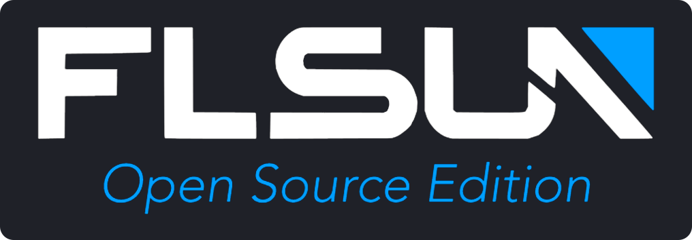

**FLSUN-OS** is an Open Source version for **FLSUN S1** that uses the microSD port of the core board to boot on a new OS.

This means that the Stock OS is not modified. It’s a kind of dual boot, it's easy to go back to Stock OS.

This new OS is based on :simple-debian: ***Debian 12 Bookworm*** and is ready to use. It's more stable and has better performance. 
It has the advantage of having a support until June 2028 unlike Debian 10 (Stock OS) which expired in June 2024.

Benchmark comparison between **STOCK OS** (Board flsun) and **Open Source Edition OS** (FLSUN-OS): <a href="https://browser.geekbench.com/v5/cpu/compare/22823940?baseline=22823878">:material-web: Geekbench.com</a>

**What's included:**

  - Moonraker (latest build without modification) 
  - Klipper (latest build with modifications for S1 support, repo is available <a href="https://github.com/Guilouz/Klipper-Flsun-S1">:material-github: here</a>) 
  - KlipperScreen (latest build with modifications for S1 support, repo is available <a href="https://github.com/Guilouz/KlipperScreen-Flsun-S1">:material-github: here</a>) 
  - Mainsail (latest build without modification) 
  - MJPG-Streamer (latest build) 
  - Kiauh (latest build) 
  - Moonraker Timelapse 
  - Preconfigured Web interfaces 
  - Improved configuration files (M600 support, Drying Box from Web UI support, etc...) 
  - Improved Power Loss Recovery 
  - Enhanced Delta Calibration support (More accurate and with denser coverage that allows better detection of variations of the bed or in the mechanics of the printer, which can improve print quality) 
  - Bed Mesh Type before printing support (Full Bed Mesh, Adaptive Bed Mesh or No Mesh) 
  - Easy Installer to facilitate programs installation and some actions with the simple **`easy-installer`** command in SSH
  - Hostname based on MAC address 
  - Automatic resizing of available storage space 
  - BigTreeTech MMB Cubic support (Chamber Temperature Sensor and Neopixels) 
  - Possibility to install FLSUN OS on eMMC memory 

!!! Note
    All AI features have been removed as they do not work as expected. Only Power Loss Recovery and XY Dimension Calibration features have been kept.

 

**If you like my work, don't hesitate to support me by paying me a 🍺 or a ☕. Thank you 🙂**

