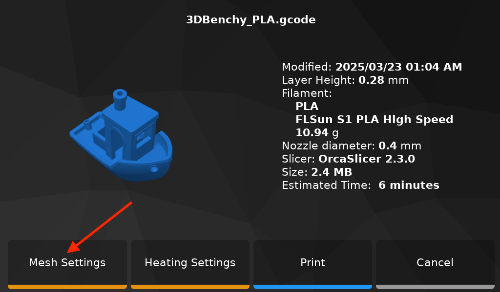
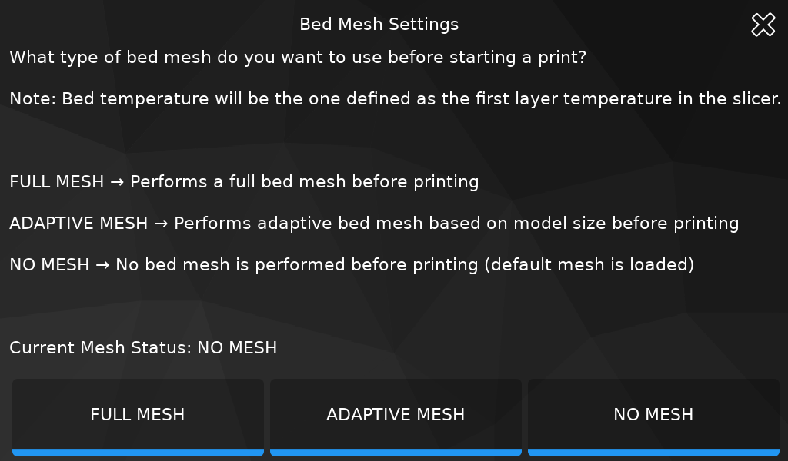
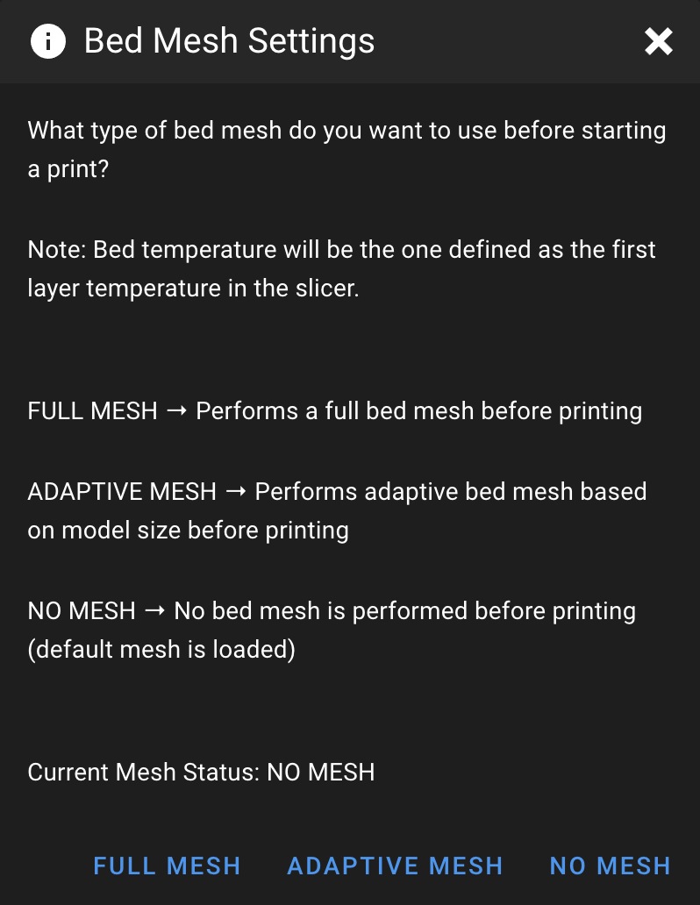
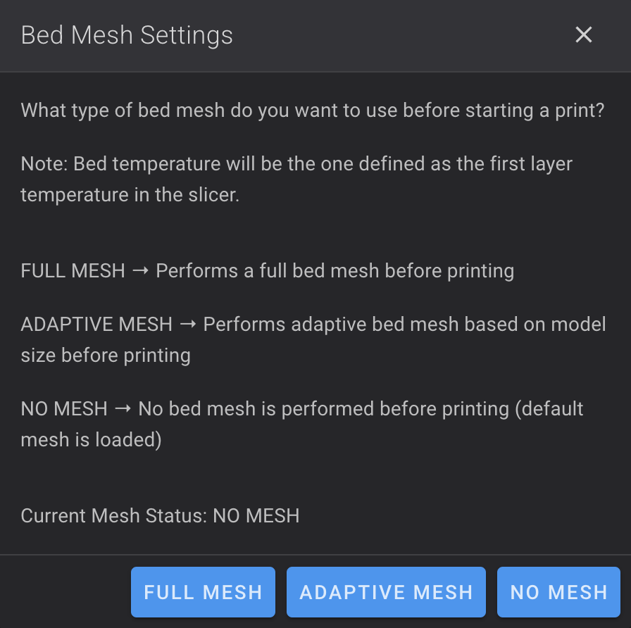
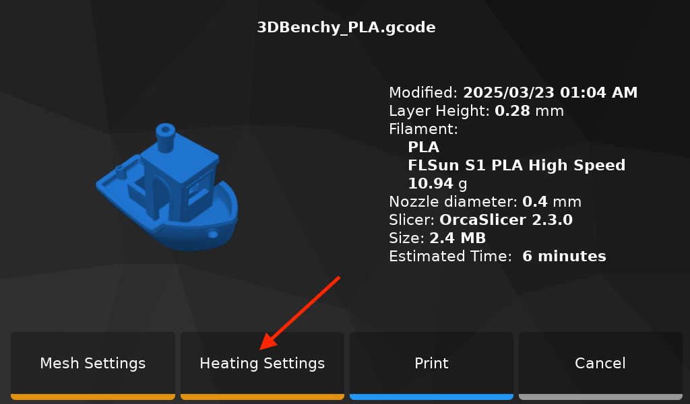
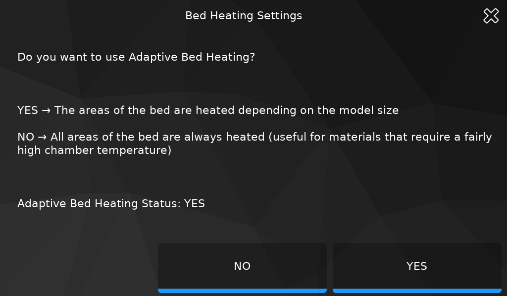
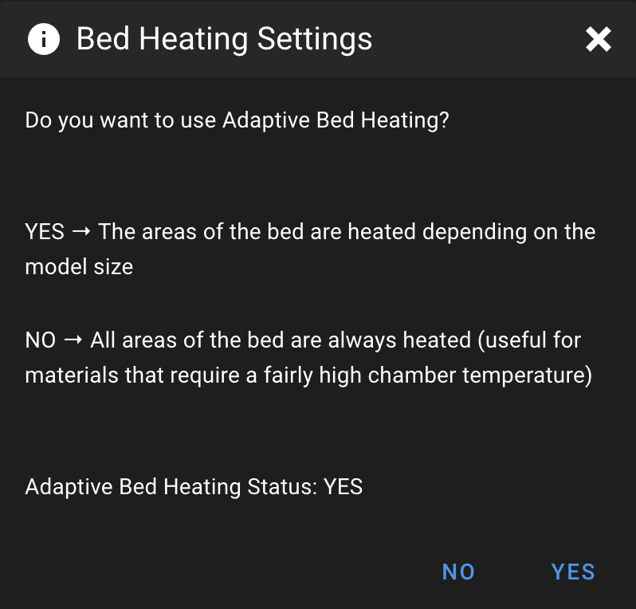
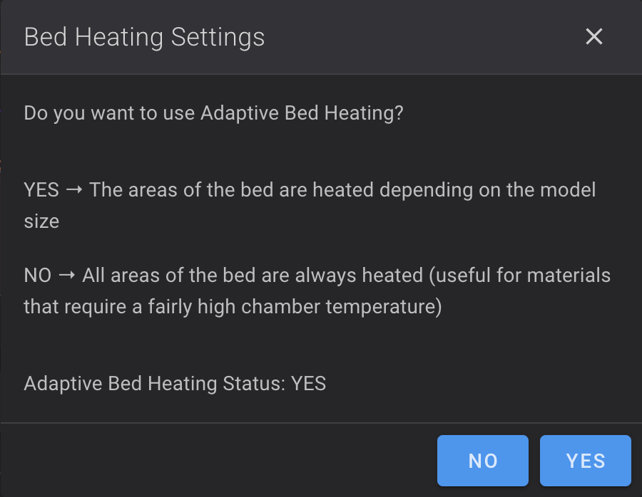

### Improved Delta Calibration
<hr>

Improved Delta Calibration function is a new introduced method. It is more accurate and with denser coverage that allows better detection of variations in the bed or printer mechanics, which can improve print quality.

It's enabled by default but if you want to disable it, follow these steps:

- Open **`printer.cfg`** file:

    - On **Mainsail** Web Interface go to **`MACHINE`** tab on the left side.
    - On **Fluidd** Web Interface go to **`Configuration`** icon on the left side.

- Search this line in **`Bed Settings`** section:

    ``` title="printer.cfg" hl_lines="5"
    [delta_calibrate]
	radius: 154
	horizontal_move_z: 10
	speed: 100
	enhanced_method: True  # False -> Use classic method | True -> Use enhanced method
    ```
 
- And replace the value to **False**:

    ``` title="printer.cfg" hl_lines="5"
    [delta_calibrate]
	radius: 154
	horizontal_move_z: 10
	speed: 100
	enhanced_method: False  # False -> Use classic method | True -> Use enhanced method
    ```

- Once done, click on **`SAVE & RESTART`** button at the top right to save the file.


### Bed Mesh Settings
<hr>

- First, make sure you have made the changes in your slicer by following <a href="../slicers-settings">:material-printer-3d: Slicers Settings</a> section.

- It's possible to define the bed mesh type before starting a print among these 3 possibilities:

	- **FULL BED MESH** → Performs a full bed mesh (saved as temporary mesh: `full_mesh`)
	- **ADAPTIVE MESH** → Performs adaptive bed mesh based on model size (saved as temporary mesh: `adaptive_mesh`)
	- **NO MESH** → No bed mesh is performed before printing (`default` mesh is used)

	!!! Warning
        In case **NO MESH** is defined, it's important to have performed the printer calibrations to have a default mesh saved.
  
- It's accessible from the screen before starting a print:

	

	

- Or, you can define bed mesh type with **`BED_MESH_SETTINGS`** macro:

	| Mainsail | Fluidd |
	| :---------: | :---------: |
	|  |  |

!!! Note
    The **Current Status** shown is saved and loaded automatically when the printer starts.
 
 
### Bed Heating Settings
<hr>

- First, make sure you have made the changes in your slicer by following <a href="../slicers-settings">:material-printer-3d: Slicers Settings</a> section.

- It's possible to enable/disable the adaptive bed heating feature before starting a print:

	- **YES** → The areas of the bed are heated depending on the model size (by default)
	- **NO** → All areas of the bed are always heated (useful for materials that require a fairly high chamber temperature)
  
- It's accessible from the screen before starting a print:

	

	

- Or, you can define bed mesh type with **`BED_HEATING_SETTINGS`** macro:

	| Mainsail | Fluidd |
	| :---------: | :---------: |
	|  |  |

!!! Note
    The **Current Status** shown is saved and loaded automatically when the printer starts.
 
 
### Troubleshootings
<hr>

In case you have **`Probe samples exceed samples_tolerance`** message when probing:

- First, try this:
 
	<iframe width="900" height="506" src="../assets/videos/Fix_Bed_Issue.mp4" title="Fix Bed Issue" frameborder="0" allow="accelerometer; clipboard-write; encrypted-media; gyroscope; picture-in-picture; web-share" referrerpolicy="strict-origin-when-cross-origin" allowfullscreen></iframe> 
 
 - You can also try to increase **samples_tolerance** value:
 
 - Open **`printer.cfg`** file:

    - On **Mainsail** Web Interface go to **`MACHINE`** tab on the left side.
    - On **Fluidd** Web Interface go to **`Configuration`** icon on the left side.

- Search this line in **`Probe Settings`** section and increase this value:
 
    ``` title="printer.cfg" hl_lines="10"
    [probe]
    pin: !PD4
    x_offset: 0
    y_offset: 0
    z_offset: -0.25
    speed: 10
    samples: 3
    samples_result: average
    sample_retract_dist: 5
    samples_tolerance: 0.08
    samples_tolerance_retries: 7
    ```

	!!! Warning
        **Increasing this value too much may decrease accuracy.**

- Once done, click on **`SAVE & RESTART`** button at the top right to save the file.

<br />

**If you like my work, don't hesitate to support me by paying me a 🍺 or a ☕. Thank you 🙂**

<a href="https://ko-fi.com/guilouz" target="_blank"></a>
