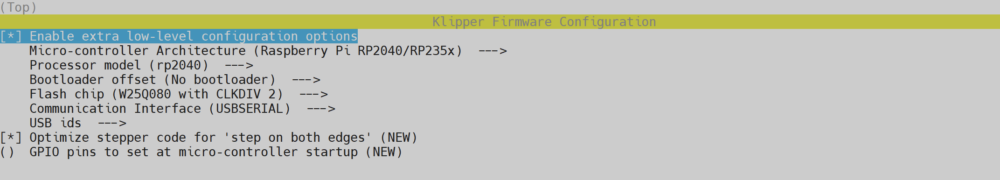

The **BigTreeTech MMB Cubic** is the ideal solution for fitting additional interfaces onto your printer, allowing you to connect more things like, Neopixels, temperature sensors, etc...

Here we will see the addition of Neopixels and a chamber temperature sensor.


### Interface Diagram
<hr>


### Prerequisites
<hr>

- BigTreeTech MMB Cubic: <a href="https://biqu.equipment/products/bigtreetech-mmb-cubic-v1-0-mainboard-expansion-board">:material-web: Biqu</a>
- 2 x 18 AWG (minimum) silicone electrical wire to power the BigTreeTech MMB Cubic
- 1 x USB-C cable
- MMB Cubic Mount to print: <a href="../assets/downloads/MMB_Cubic_Mount.stl">:material-download: MMB_Cubic_Mount.stl</a>
- 4 x M3x8 screws to fix MMB Cubic to mount
- Double-sided tape to secure the mount in the lower part of the printer
- WS2812B - 5V LED strip (to replace existing LED strips)
- 1 x NTC 100k Thermistor Temperature Sensor (I use the one from FLSUN V400 because it has the advantage of having a long cable)


### Wiring
<hr>


!!! Note
	**BigTreeTech MMB Cubic** can be powered over USB but I don't recommend this for better performance.


### Compiling Firmware
<hr>

- Connect to printer over SSH (see <a href="../ssh-connection">:material-console: SSH Connection</a> section).

- In the SSH command prompt window, enter the following commands (one at a time):

    ``` title="SSH Command Prompt"
    cd ~/klipper/
    ```
    ``` title="SSH Command Prompt"
    make menuconfig
    ```

- Move on the menu with the ++"↑"++ and ++"↓"++ keys of your keyboard and validate the selected item with the ++"Enter"++ key and select these settings:

    


- Then on your keyboard press the ++"Q"++ key then ++"Y"++ to save configuration.

- Enter the following commands (one at a time) to compile firmware:

    ``` title="SSH Command Prompt"
    make clean
    ```
    ``` title="SSH Command Prompt"
    make
    ```

- When make is completed, the required **klipper.bin** firmware will be generated in the **`home/pi/klipper/out`** folder.


### Flash Firmware
<hr>

- If **BigTreeTech MMB Cubic** is already connected via USB-C, unplug it.

- Hold down the **`BOOT`** button and connect **BigTreeTech MMB Cubic** to printer with a USB-C cable. This allows the chip to enter DFU mode:

    
 
 
 - In the SSH command prompt window, enter the following command to query the DFU device ID (it should be named **Raspberry Pi RP2 Boot**):
 
	``` title="SSH Command Prompt"
    lsusb
    ```

    


- Enter the following commands (one at a time) to flash firmware by replacing **`xxxx:xxxx`** with the actual device ID obtained in the previous step:

    ``` title="SSH Command Prompt"
    cd ~/klipper/
    ```
    ``` title="SSH Command Prompt"
    make flash FLASH_DEVICE=xxxx:xxxx
    ```
    
    !!! Example
        ``` title="SSH Command Prompt"
        make flash FLASH_DEVICE=2e8a:0003
        ```

- After flashing, enter the following command to query the device Serial ID:

    ``` title="SSH Command Prompt"
    ls /dev/serial/by-id/
    ```

    

- Copy the Serial ID it will be used later for the configuration file.

!!! Note
    There is no need to manually press the BOOT button to enter DFU mode for subsequent updates after the first flashing is completed.<br /><br />
    To update **BigTreeTech MMB Cubic** firmware just use this command by replacing **xxxxx`** by your Serial ID:<br />
    ``` title="SSH Command Prompt"
    make flash FLASH_DEVICE=/dev/serial/by-id/usb-Klipper_rp2040_xxxxx
    ```
    <br />
    !!! Example
        ``` title="SSH Command Prompt"
        make flash FLASH_DEVICE=/dev/serial/by-id/usb-Klipper_rp2040_5044340310A8901C-if00
        ```

### Configuration
<hr>

MMB Cubic can be configured automatically with <a href="../easy-installer">:material-star: Easy Installer</a> or with **Printer Setup Wizard** from **KlipperScreen** or Web interface (<br />see <a href="../update-and-configure-printer">:material-file-restore: Update and Configure Printer</a> section) but if you need to configure it manually follow these steps.

- Open **`config.cfg`** file:

    - On **Mainsail** Web Interface go to **`MACHINE`** tab on the left side.
    - On **Fluidd** Web Interface go to **`Configuration`** icon on the left side.

- Edit the **`Configurations`** section:

    ``` title="config.cfg" hl_lines="8 9 15 21 22"
    #######################################################
    # BigTreeTech MMB Cubic Configuration
    #######################################################
    
    # If you use BigTreeTech MMB Cubic -> Enable this lines and set the serial
    # ------------------------------------------------------------------------
    
    #[mcu MMB_Cubic]
    #serial: /dev/serial/by-id/usb-Klipper_rp2040_xxxxx
    
    
    # If you use Chamber Temperature Sensor with BigTreeTech MMB Cubic -> Enable 'temp-sensor-mmb-cubic.cfg'
    # ------------------------------------------------------------------------------------------------------
    
    #[include Configurations/temp-sensor-mmb-cubic.cfg]
    
    
    # If you use Neopixels with BigTreeTech MMB Cubic -> Disable 'led-stock.cfg' and Enable 'led-mmb-cubic.cfg'
    # ---------------------------------------------------------------------------------------------------------
    
    [include Configurations/led-stock.cfg]
    #[include Configurations/led-mmb-cubic.cfg]
    ```

    - Edit the **serial** parameter by replacing **xxxxx`** with your previously obtained serial ID.

- Once done, click on **`SAVE & RESTART`** button at the top right to save the file.

- Open **`led-mmb-cubic.cfg`** file in **`Configurations`** folder and edit the **chain_count** parameter by the number of LEDs your strips contain:

    ``` title="led-mmb-cubic.cfg" hl_lines="3"
    [neopixel chamber_led]
    pin: MMB_Cubic:gpio9
    chain_count: 20
    color_order: GRB
    initial_RED: 1.0
    initial_GREEN: 1.0
    initial_BLUE: 1.0
    ```

- Once done, click on **`SAVE & RESTART`** button at the top right to save the file.

- You should see the **MMB Cubic** MCU connected in the system information:

	| Mainsail |
	| :---------: |
	|  |

    | Fluidd |
	| :---------: |
	|  |

- You can now control Neopixels from screen in **`Configurations`** → **`LED`** menu:

    


    

- If you use chamber temperature sensor, you can see the temperature here:

    


### Update MCU firmware
<hr>

!!! Note
    MCUs have limited write cycles. Updating the firmware with each Klipper release could shorten the life of your MCU!<br /><br />
    <i>**When is it necessary to update MCU firmware?**</i><br />
    Every time Klipper mentions to update the MCU at startup, no more.


To update to a future MCU firmware of your MMB Cubic, follow these steps:

- Connect to printer over SSH (see <a href="../ssh-connection">:material-console: SSH Connection</a> section).

- In the SSH command prompt window, enter the following command to start **Easy Installer**:

    ``` title="SSH Command Prompt"
    easy-installer
    ```

    

- Enter ++"3"++ for **Extras** menu → ++"3"++ for **Update MMB Cubic MCU firmware** → ++"Enter"++ to confirm your choice:

    

- Klipper firmware will be builded and flashed.

- When it's done, Turn the printer off and on.

<br />

**If you like my work, don't hesitate to support me by paying me a 🍺 or a ☕. Thank you 🙂**

<a href="https://ko-fi.com/guilouz" target="_blank"></a>
