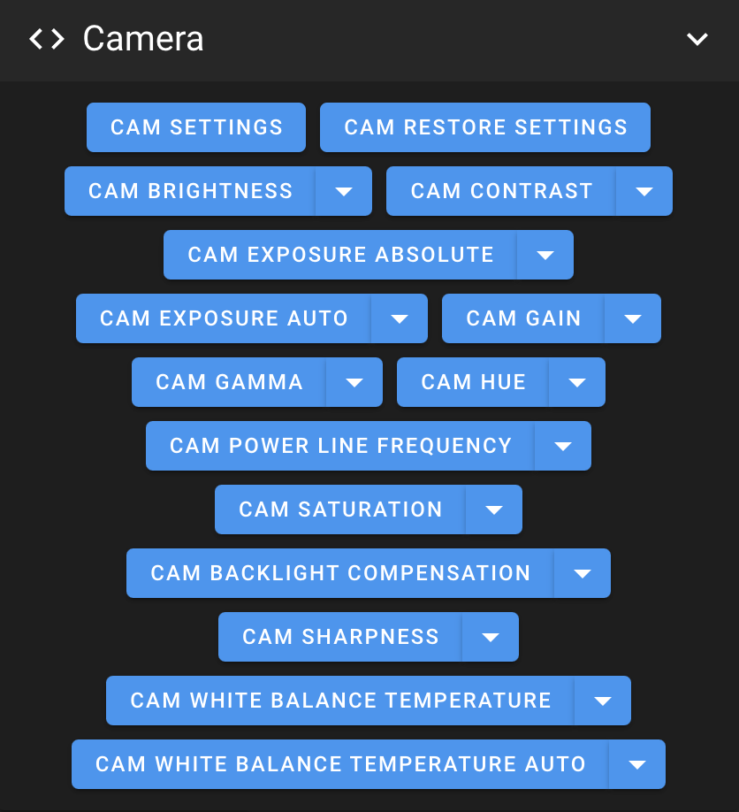
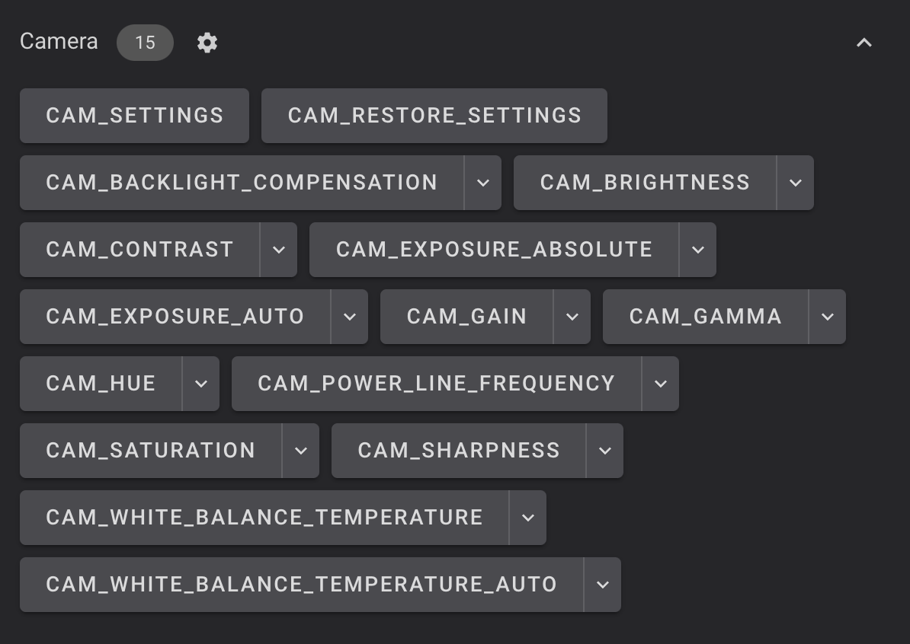

Camera Settings Control allows you to configure settings like Brightness, Contrast, Saturation, etc... with macros.<br />
It's not enabled by default. To enable it:

- Open **`printer.cfg`** file:

    - On **Mainsail** Web Interface go to **`MACHINE`** tab on the left side.
    - On **Fluidd** Web Interface go to **`Configuration`** icon on the left side.

- Remove the first **`#`** symbol at the following line:

    ``` title="printer.cfg"
    #[include camera_settings.cfg] # Remove comment to use macros to control camera settings
    ```

- Click on **`SAVE & RESTART`** at the top right to save the file.

- You can now control camera settings with macros:

	| Mainsail | Fluidd |
	| :---------: | :---------: |
	|  |  |

    - **CAM SETTINGS** → Displays the current camera settings in the console
    - **CAM RESTORE SETTINGS** → Restores the camera to default settings
    <br /><br />
    #### Default Settings:
      - **Brightness** → 0 (Min: -64 | Max: 64)
      - **Contrast** → 0 (Min: 0 | Max: 95)
      - **Saturation** → 56 (Min: 0 | Max: 100)
      - **Hue** → 0 (Min: -2000 | Max: 2000)
      - **White Balance Auto** → 1 (Disabled: 0 | Enabled: 1)
      - **Gamma** → 100 (Min: 100 | Max: 300)
      - **Gain** → 28 (Min: 0 | Max: 128)
      - **Power Line Frequency** → 1 (Disabled: 0 | 50Hz: 1 | 60Hz: 2)
      - **White Balance Temperature** → 4600 (Min: 2800 | Max: 6500)
      - **Sharpness** → 2 (Min: 0 | Max: 7)
      - **Backlight Compensation** → 0 (Min: 0 | Max: 1)
      - **Exposure Auto** → 3 (Manual Mode=1 | Aperture Priority Mode=3)
      - **Exposure Absolute** → 166 (Min: 3 | Max: 2047)

<br />

**If you like my work, don't hesitate to support me by paying me a 🍺 or a ☕. Thank you 🙂**

<a href="https://ko-fi.com/guilouz" target="_blank"></a>
