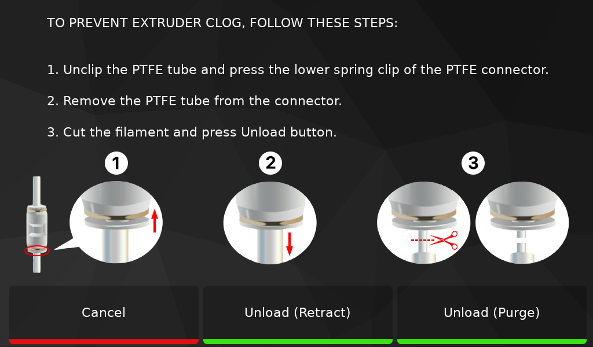

## FLSUN OS - 2.0.2

!!! Note
    To update to this version, just update **`FLSUN-OS-Dependencies`** in **Update Manager**.

- Updated motherboard configuration for firmware compilation.
- Updated **Moonraker**, **Klipper** and **KlipperScreen** environments.

## FLSUN OS - 2.0.1

!!! Note
    To update to this version, just update **`FLSUN-OS-Dependencies`** in **Update Manager**.

- Updated motherboard configuration for firmware compilation.
- Updated **KlipperScreen**:
    - Added interactive top bar icons during heating.
    - Added possibility to lock screen during printing (in shortcuts bar).
    - Moved **`LED`** function to shortcuts bar.
- Updated **Moonraker**, **Klipper** and **KlipperScreen** environments.

## FLSUN OS - 2.0

!!! Important
    **This new OS version must be reinstalled!** 
    In the future, it will no longer be necessary to reinstall the OS to update to a new OS version.
 
- Upgraded Kernel to v6.1.99 a little faster and which now gives access to the 1 GB of RAM (700 MB on Stock OS).
- Enabled ZRAM swap to add extra 512 MB ram for safety.
- Introduced **FLSUN OS Dependencies** that can be updated via Update Manager to avoid having to reinstall the OS each time:
    - Allows you to update system files.
    - Allows you to update **Easy Installer** with new changes.
    - Automatically checks configuration files and notifies you if a new update is available (when updating **Klipper**).
- Improved **Easy Installer**:
    - Added an **`Update`** menu for all update features.
    - Reworked **`Update Klipper Configuration Files`** feature. It now only updates files that need to be updated.
    - It is now possible to configure the printer at any time without needing to download the configuration files.
- Updated **Klipper** configuration files:
    - Added new **`PRINTER_SETUP_WIZARD`** macro to configure your printer from Web interface.
    - Added new **`UPDATE_CONFIGURATION_FILES`** macro to update Klipper configuration files from Web interface.
    - Fixed issue with **`Adapted Bed Heating`** feature not working properly.
    - Fixed issue with **`Adapted Bed Heating`** feature when first layer has different temperature than other layers.
    - Necessary End Gcodes are now correctly applied when printing is canceled.
    - Added wait for current moves to finish before restarting Klipper during calibrations.
    - Added new macros for updates features.
    - Improved logic of some macros.
    - Updated **Moonraker** configurations for **FLSUN OS Dependencies**.
 - Updated **KlipperScreen**:
    - Reorganization of menus.
    - Removed calibration warning on **`Print Panel`** which sometimes created false positives.
    - Added new panel with QR Code to directly access the Wiki on **`System Panel`**.
    - Added possibility to update **Klipper** configuration files on **`Updates Panel`**.
    - Added possibility to configure your printer on **`System Panel`**.
    - Improved **`Jobs Status Panel`**.
    - Improved **`LED Panel`**.
    - Improved **`Fine Tune Panel`**.
- Updated **Moonraker** and **KlipperScreen** environments.
- Updated Wiki for this new OS.

## FLSUN OS - 1.5.1

!!! Important
    **This new OS version must be reinstalled, it can't be updated with **`easy-installer`** command in SSH. 
    Klipper and KlipperScreen have been updated accordingly and all configurations that could be downloaded with older OS versions are deprecated and have been removed. 
    You also need to flash the motherboard with the new firmware. See <a href="../flash-motherboard-firmware">:octicons-cpu-16: Flash Motherboard Firmware</a> section.**

- Klipper Configuration files are now unified, one set of configurations for all variants.
- Added support for **BigTreeTech Smart Filament Sensor V2.0**.
- Added support for <a href="https://github.com/Arksine/katapult">Katapult</a> bootloader. This allows to update future Klipper firmware without microSD card or STM32 Programmer.
- Added support for <a href="https://github.com/Annex-Engineering/klipper_estimator">Klipper Print Time Estimator</a>. After uploading a Gcode, a post-process on it is immediately performed prior to metadata extraction according to the printer settings.
- Added new feature to enable/disable Adaptive Bed Heating with `BED_HEATING_SETTINGS` macro or from **KlipperScreen**. See  <a href="../bed-settings/#bed-heating-settings">Bed Heating Settings</a> section.
- Reworked the logic of bed heating:
    - M140 S`<temperature>` → Set Inner and Outer beds temperature
    - M140 S`<temperature>` B0 → Set Inner bed temperature
    - M140 S`<temperature>` B1 → Set Outer bed temperature
    - M190 S`<temperature>` → Set Inner and Outer beds temperature and wait
    - M190 S`<temperature>` B0 → Set Inner bed temperature and wait
    - M190 S`<temperature>` B1 → Set Outer bed temperature and wait
- Updated **Easy Installer**:
    - Added possibility to update motherboard MCU firmware.
    - Added possibility to update BigTreeTech MMB Cubic MCU firmware.
    - You can now download the latest Klipper configuration files and configure the desired features.
- Improved Power Loss detection.
- Fixed Chamber LED state after OFF/ON switch when brightness was changed from KlipperScreen or Web interface. Now the previous state is correctly restored.
- Fixed Neopixel LED state after OFF/ON switch when color was changed from KlipperScreen or Web interface. Now the previous state is correctly restored.
- Minor fixes.

## FLSUN OS - 1.4

- Added in-image security with bootloader core board: In case the eMMC is corrupted or unbootable, booting via microSD is still possible.
- Now possible to install **FLSUN OS** on eMMC. See <a href="../install-flsun-os-on-emmc">:octicons-cpu-16: Install FLSUN OS on eMMC</a> section.
- Added possibility to Unload Filament with Purge or Retraction with new macros. **KlipperScreen** has also been updated for this.

    

You can update configuration files with **`easy-installer`** command in SSH but for more security it's necessary to install this new image.

## FLSUN OS - 1.3

- The system is now shutdown properly when the printer is powered off.
- Reworked Power Loss Recovery. It now resumes exactly where it left off and it also preserves all settings like filament used, chamber fan speed, extrude mode, speed factor, extrude factor and all velocity parameters. **Klipper** has also been updated for this.
- Improved Bed Mesh with `zero_reference_position` parameter.
- Added support for Chamber LED brightness control in **KlipperScreen**.
- Macros now respect current configuration settings.
- Improved Gcode Offsets to apply them to Endstops. **KlipperScreen** has also been updated for this.
- Improved Bed Mesh with `zero_reference_position` parameter.
- Improved `SET_GCODE_OFFSET` macro.
- Improved `RESUME` macro: Shutdown fan for heating.
- Set default PID Hotend Calibration temperature to reasonable 250°C.
- Changes default extruder curent to 0.8.
- Updated **KlipperScreen** environment.

You can update configuration files for fixes with **`easy-installer`** command in SSH. Environment is updated automatically when **KlipperScreen** is updated with Update Manager.

## FLSUN OS - 1.2.2

- Fixed issue with error message `dict object has no attribute max_power` when resuming.

You can update configuration files for fixes with **`easy-installer`** command in SSH.

## FLSUN OS - 1.2.1

- Fixed issue with error message `This macro cannot be used while printing!`.
- `SET_TMC_CURRENT` command now integrated in macros. It's no longer necessary to add it in the slicer Start Gcode.

You can update configuration files for fixes with **`easy-installer`** command in SSH.

## FLSUN OS - 1.2

- Added **Easy Installer** to facilitate installations and some actions with the simple **`easy-installer`** command in SSH:
    - Install/Update/Remove **Spoolman** (Filament Spools Management).
    - Install/Remove **GuppyFLO** (Remote Access via TCP Proxy).
    - Backup/Restore **Klipper** configuration files.
    - Backup/Restore **Moonraker** database.
    - Delete cache and logs files.
    - Update **Debian** packages.
    - Restore Web-UI default settings.
    - Restore SSH access for Stock OS.
- Added support for Numpy.
- Added possibility to generate resonances graphics with `GENERATE_RESONANCES_GRAPHICS` macro.
- Added support for **BigTreeTech MMB Cubic** to add chamber temperature sensor and Neopixels.
- Added support to choose Bed Mesh type before printing. You can now choose type of bed mesh you want to start before printing (Full Bed Mesh, Adaptive Bed Mesh or No Mesh).
- Added possibility to take screenshots of **KlipperScreen** with `_SCREENSHOT` command (screenshots are saved in config folder).
- Improved **Delta Calibration** function with new enhanced method. More accurate and with denser coverage that allows better detection of variations of the bed or in the mechanics of the printer, which can improve print quality. You can revert back to classic method by changing `enhanced_method` parameter to **`False`** (in `[delta_calibrate]` function of `printer.cfg` file).
- Updated **KlipperScreen** service file to wait for Moonraker if present, to not fail the connection on startup and having to retry.
- Updated Virtual Environments.
- Updated `.kiauh.ini` file to allow to use the new **Kiauh** version.
- **Kiauh** can now be started with the simple **`kiauh`** command in SSH.
- Updated **Klipper** configuration files.
- Integrated latest Moonraker, Klipper, KlipperScreen, Mainsail and Kiauh builds.

## FLSUN OS - 1.1 (Beta Release)

- Updated kernel to restore CPU frequency to 1.5GHz instead of 1GHz (50% increase in performance).
- Disabled Wi-Fi Power Management, this frees up bandwidth, and increases camera fps.
- Integration of **GuppyFLO**, a lightweight self-hosted service that allows remote management via TCP Proxy using Moonraker and Tailscale.
- Replaced hostname `FLSUN-OS-XXXX` with `FLSUN-S1-XXXX` (still based on MAC address).
- Improved SSH header.
- Updated **Klipper** configuration files.
- Updated Web interface configuration files.
- Integration of FLSUN Gcodes files.
- Fixed screen brightness.

## FLSUN OS - 1.0 (Beta Release)

- Initial Beta Release

 

**If you like my work, don't hesitate to support me by paying me a 🍺 or a ☕. Thank you 🙂**

