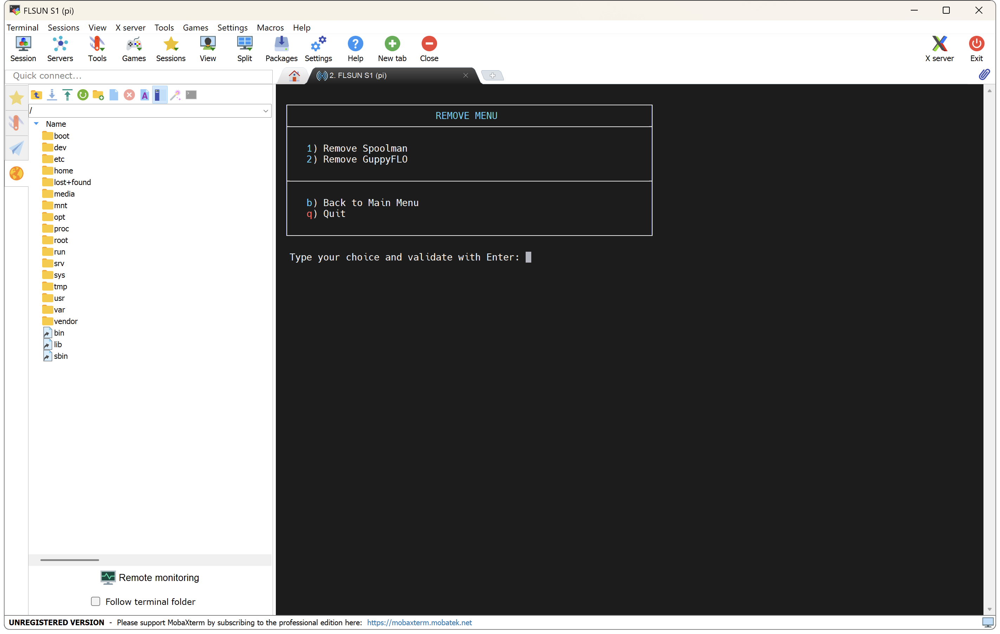

**Easy Installer** allows you to install programs or perform some actions in an easy way.

- To run it, connect to printer over SSH (see <a href="../ssh-connection">:material-console: SSH Connection</a> section).

- In the SSH command prompt window, enter the following command to start **Easy Installer**:

	``` title="SSH Command Prompt"
	easy-installer
	```

	


	### Install Menu
	
	


	- **Install or Update Spoolman** → See <a href="../spoolman/#install-spoolman">:material-circle-double: Spoolman</a>
	- **Install GuppyFLO** → See <a href="../remote-access/#install-guppyflo">:material-earth: Remote Access</a>


	### Remove Menu

	


	- **Remove Spoolman** → See <a href="../spoolman/#remove-spoolman">:material-circle-double: Spoolman</a>
	- **Remove GuppyFLO** → See <a href="../remote-access/#remove-guppyflo">:material-earth: Remote Access</a>


	### Extras Menu

	


	- **Set Klipper configuration to use** → See <a href="../klipper-configurations-files">:material-file-restore: Klipper Configurations Files</a>
	- **Backup Klipper configuration files** →This allows to backup Klipper configuration files to a `backup_klipper.zip` compressed file
	- **Restore Klipper configuration files** → This allows to restore Klipper configuration files from a `backup_klipper.zip` compressed file
	- **Backup Moonraker database** → This allows to backup Moonraker database to a `backup_moonraker.zip` compressed file
	- **Restore Moonraker database** → This allows to restore Moonraker database from a `backup_moonraker.zip` compressed file
	- **Delete cache and logs files** → This allows to delete temporary files and log files
	- **Update Debian packages** → This allows to update installed packages from Debian repository
	- **Restore Web-UI default settings** → This allows to restore the pre-configured settings of Mainsail and Fluidd Web interfaces
	- **Restore SSH access for Stock OS** → This allows to restore SSH access when you are running FLSUN's Stock OS

<br />

**If you like my work, don't hesitate to support me by paying me a 🍺 or a ☕. Thank you 🙂**

<a href="https://ko-fi.com/guilouz" target="_blank"></a>
