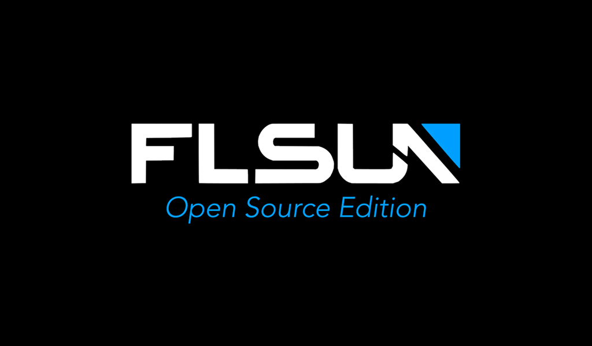

- Turn on the printer and you should see the "**Open Source Edition**" boot logo:

	

	If not, your image was not correctly written, retry: <a href="../prepare-microsd-card-for-flsun-os">:material-micro-sd: Prepare microSD Card for FLSUN OS</a>  or <a href="../install-flsun-os-on-emmc">:octicons-cpu-16: Install FLSUN OS on eMMC</a>

- When it first starts, the OS will perform several actions (resizing storage size, configuring Web interfaces, etc...) and the printer will restart once finished.

- After reboot, once you are on the **KlipperScreen** interface, click on **`Configurations`** → **`Network`** and connect to your WiFi network. Your local IP address should be displayed in the top right corner.

- Wait for **Moonraker** and **Klipper** to connect, if not click **`Retry`** button. The LEDs on the left side of the screen should light up white as soon as the connection is established.

- Next, take a look to <a href="../update-and-configure-printer">:material-file-restore: Update and Configure Printer</a> section.

 

**If you like my work, don't hesitate to support me by paying me a 🍺 or a ☕. Thank you 🙂**

