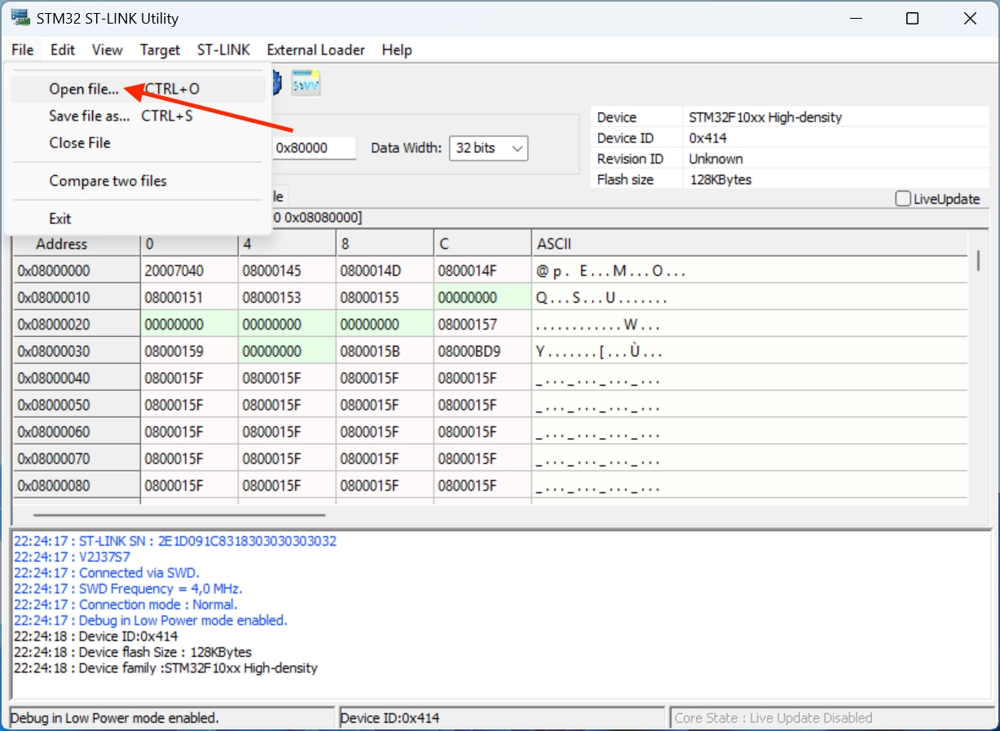

This new firmware improves motor resonance and fixes much of the salmon skin encountered on the stock firmware. It's the same firmware used on S1 Pro and it's recommended to update. 

Although it is possible to flash the firmware without having the Dupont cable provided in the Silent Kit, for the sake of simplicity this is what we will cover here.

### Prerequisites

- Closed Loops Boards firmware (original from FLSUN): <a href="../assets/downloads/firmwares/open-source-edition/closed_loop_board_fw.bin" >:material-download: closed_loop_board_fw.bin</a>
- Dupont connection cable provided with FLSUN Silent Kit
- STL file to print: <a href="../assets/downloads/firmwares/Closed_Loop_Boards_Tool.stl">:material-download: Closed_Loop_Boards_Tool.stl</a>
- STM32 ST-LINK Utility (:material-microsoft-windows: Windows only): <a href="../assets/downloads/firmwares/STM32_ST-LINK_Utility_v4.6.0.zip" >:material-download: STM32_ST-LINK_Utility_v4.6.0.zip</a>
- ST-LINK V2 Programmer: <a href="https://www.amazon.fr/Youmile-St-Link-Programme-t%C3%A9l%C3%A9chargement-Programmation/dp/B07QBLNDPM">:simple-amazon: Amazon FR</a> / <a href="https://www.amazon.com/HiLetgo-Emulator-Downloader-Programmer-STM32F103C8T6/dp/B07SQV6VLZ">:simple-amazon: Amazon US</a> / <a href="https://www.amazon.ca/ST-Link-Programming-Emulator-Downloader-Random/dp/B01J7N3RE6">:simple-amazon: Amazon CA</a>

!!! Note 
    If you want to restore stock firmware for Closed Loops Boards use this firmware: <a href="../assets/downloads/firmwares/stock/closed_loop_board_fw_stock.bin" >:material-download: closed_loop_board_fw_stock.bin</a>

### Install STM32 ST-LINK Utility

!!! Note
    You can skip this step if you have already installed the utility.

- Unzip **`STM32_ST-LINK_Utility_v4.6.0.zip`** file and run **`STM32 ST-LINK Utility v4.6.0.exe`** installer.

- Click on **`Next`** button:

    

- Click on **`Yes`** button:

    

- Click on **`Next`** button:

    

- Click on **`Finish`** button:

    

- A new window appears, click on **`Next`** button to install required drivers:

    

- Then, click on **`Finish`** button:

    

### Procedure

- Make sure your printer is turned off and unplug the 3 cables from the Closed Loops Board:

    

- Install Dupont connection cable to the printed STL Tool file and connect it to ST-LINK V2 Programmer:

    

    !!! Warning
        **Note that the colors of 3.3V and GND on the Dupont cable provided by FLSUN are reversed.  
        Not all STM32 Programmers (especially clones) have the same pin positions. Make sure to match the pins on the SMT32 Programmer with those on the Dupont cable.**

- Place the printed STL Tool file like this and make sure the board touches the bottom of the model:

    

- Connect the ST-LINK V2 Programmer to a USB port on your computer.

- Start **STM32 ST-LINK Utility** and click on **`Connect to target`** button: 

    

    If you have this message, it means the Dupont connector is not making contact with the Closed Loop Board, try « playing » with the tool until you get the connection:
    
    

    If you have this message, it means that the drivers for STM32 Programmer are not installed:
    
    

- If the connection is correct, you should get this:

	

- Click on **`File`** → **`Open file...`** and select **`closed_loop_board_fw.bin`** firmware file:

	

- Then, click on **`Program verify`** button:

	

- Make sure this information are the same, click **`Start`** button and wait for the firmware to be written:

	

- If the firmware is written successfully, the following message will appear:

	

- You can now disconnect from target by clicking on **`Disconnect`** button:

	

- You can now unplug the ST-LINK V2 Programmer from your computer and remove the tool from the Closed Loops Board.

- Reconnect the 3 cables to the Closed Loops Board and repeat this process for the other two boards.

!!! Note 
    In case you did not buy the Silent Kit, you can still flash the Closed Loops Boards by following this connection diagram but you will need to find a way to keep the cables in contact: 
    
    

    !!! Warning
        **Not all STM32 Programmers (especially clones) have the same pin positions. Make sure to match the pins on the SMT32 Programmer with those on the Closed Loop Board.**
    

 

**If you like my work, don't hesitate to support me by paying me a 🍺 or a ☕. Thank you 🙂**

