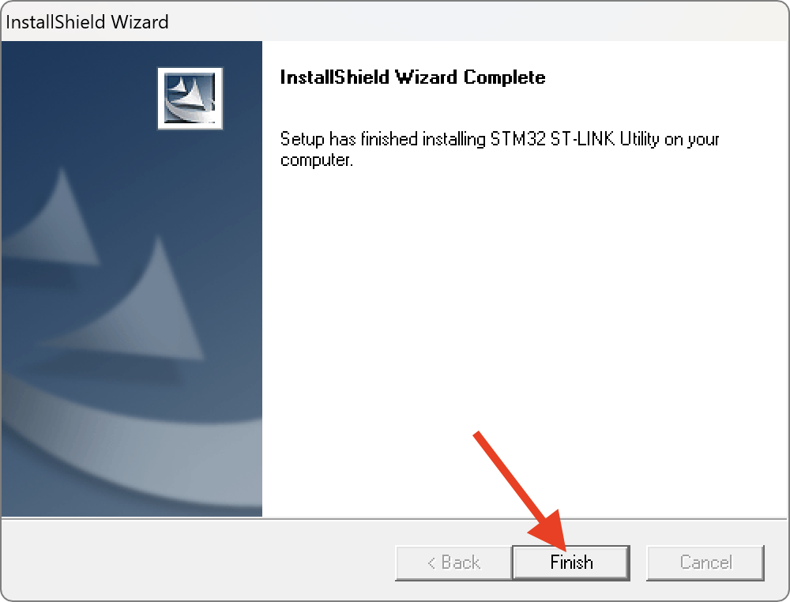
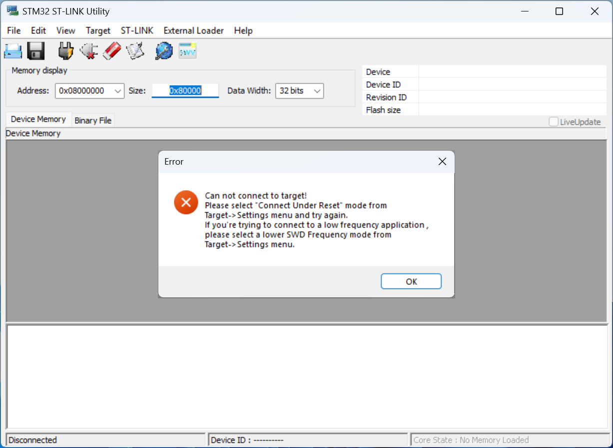

## Flash with microSD card

- Make sure the printer is turned off.

- Use the H2.0 hex wrench in the accessory box to remove the screws from the top cover of the printer.

- Insert microSD card into the microSD port on the motherboard:
  	  
      |  |  |
      | :---------: | :---------: |
      | Motherboard v1.2 | Motherboard v1.3 |

- Turn on the printer and wait a few seconds, the flash will be done automatically.

- Installation only takes a few seconds, to verify that the firmware has been successfully installed, the file on the microSD card must have been renamed to **`ROBIN_NANO35.BIN.CUR`**.

- Turn off the printer, you can remove the microSD card and screw the printer top cover back on.

- Next, follow <a href="../insert-microsd-card-with-flsun-os-in-core-board">:material-gesture-tap-button: Insert microSD Card with FLSUN OS in Core Board</a> section.

!!! Note 
    If you want to go back to stock OS you need to reflash motherboard with stock firmware: <a href="../assets/downloads/firmwares/stock/Robin_nano35.bin" >:material-download: Robin_nano35.bin</a>

## Flash with ST-LINK V2 (alternative)

If for some reason you are unable to flash the motherboard with the microSD, it may be related to the capacity of your microSD card being too large or that you have flashed the motherboard with the firmware provided by FLSUN (in the Silent Kit guide) which overrides the bootloader and prevents the use of the microSD port.

In this situation, it's necessary to flash the motherboard with a ST-LINK V2 Programmer.

### Prerequisites

- Motherboard firmware for Open Source Edition: <a href="../assets/downloads/firmwares/open-source-edition/motherboard_fw.bin" >:material-download: motherboard_fw.bin</a>
- STM32 ST-LINK Utility (:material-microsoft-windows: Windows only): <a href="../assets/downloads/firmwares/STM32_ST-LINK_Utility_v4.6.0.zip" >:material-download: STM32_ST-LINK_Utility_v4.6.0.zip</a>
- ST-LINK V2 Programmer: <a href="https://www.amazon.fr/Youmile-St-Link-Programme-t%C3%A9l%C3%A9chargement-Programmation/dp/B07QBLNDPM">:simple-amazon: Amazon FR</a> / <a href="https://www.amazon.com/HiLetgo-Emulator-Downloader-Programmer-STM32F103C8T6/dp/B07SQV6VLZ">:simple-amazon: Amazon US</a> / <a href="https://www.amazon.ca/ST-Link-Programming-Emulator-Downloader-Random/dp/B01J7N3RE6">:simple-amazon: Amazon CA</a>
- 4 Dupont cables (usually supplied with the ST-LINK V2 Programmer)

### Install STM32 ST-LINK Utility

!!! Note
    You can skip this step if you have already installed the utility.

- Extract **`STM32_ST-LINK_Utility_v4.6.0.zip`** file and run **`STM32 ST-LINK Utility v4.6.0.exe`** installer.

- Click on **`Next`** button:

    

- Click on **`Yes`** button:

    

- Click on **`Next`** button:

    

- Click on **`Finish`** button:

    

- A new window appears, click on **`Next`** button to install required drivers:

    

- Then, click on **`Finish`** button:

    

### Procedure

- Make sure your printer is turned off.

- Connect motherboard JTAG pins to ST-LINK V2 Programmer:

      

    !!! Warning
        **Not all STM32 Programmers (especially clones) have the same pin positions. Make sure to match the pins on the SMT32 Programmer with those on the motherboard.**

- Connect the ST-LINK V2 Programmer to a USB port on your computer.

- Start **STM32 ST-LINK Utility** and click on **`Connect to target`** button: 

    

    If you have this message, it means that the Dupont cables are not connected to the right places, check your connections:
    
    

    If you have this message, it means that the drivers for STM32 Programmer are not installed:
    
    

- If the connection is correct, you should get this:

	

- Click on **`File`** → **`Open file...`** and select **`motherboard_fw.bin`** firmware file:

	

- Then, click on **`Program verify`** button:

	

- Make sure this information are the same, click **`Start`** button and wait for the firmware to be written:

	

- If the firmware is written successfully, the following message will appear:

	

- You can now disconnect from target by clicking on **`Disconnect`** button:

	

- You can now unplug the ST-LINK V2 Programmer from your computer and remove Dupont cables from motherboard.

- Next, follow <a href="../insert-microsd-card-with-flsun-os-in-core-board">:material-gesture-tap-button: Insert microSD Card with FLSUN OS in Core Board</a> section.

!!! Note 
    If you want to go back to stock OS you need to reflash motherboard with this stock firmware: <a href="../assets/downloads/firmwares/stock/motherboard_fw_stock.bin" >:material-download: motherboard_fw_stock.bin</a>

 

**If you like my work, don't hesitate to support me by paying me a 🍺 or a ☕. Thank you 🙂**

