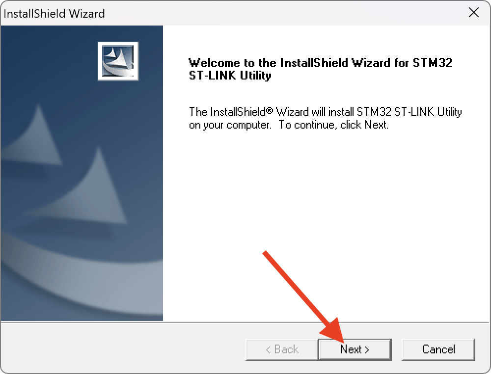
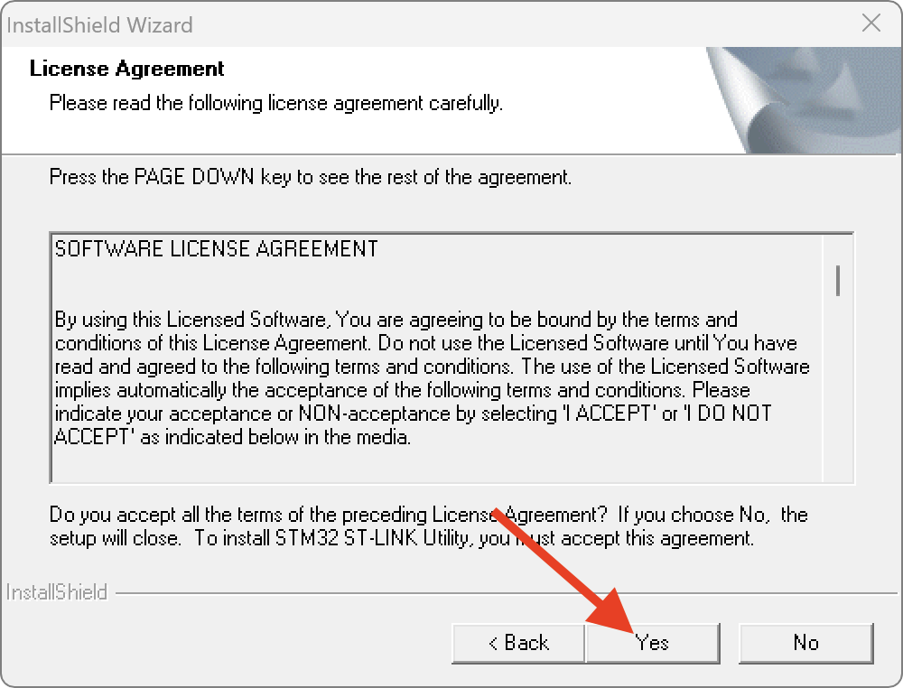
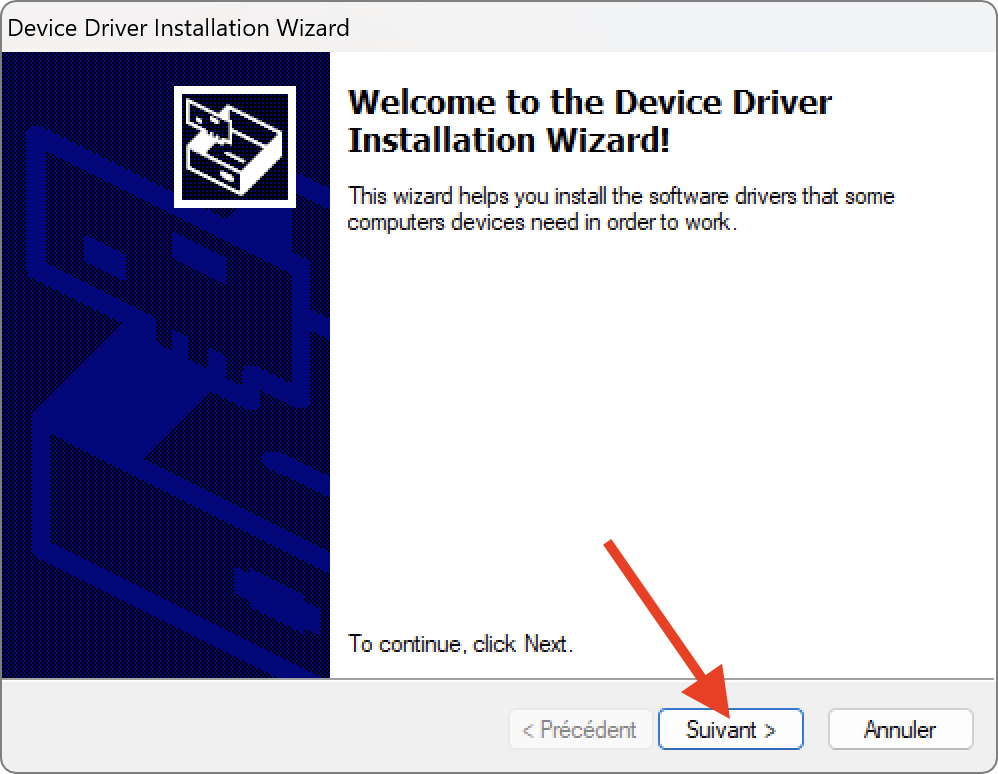
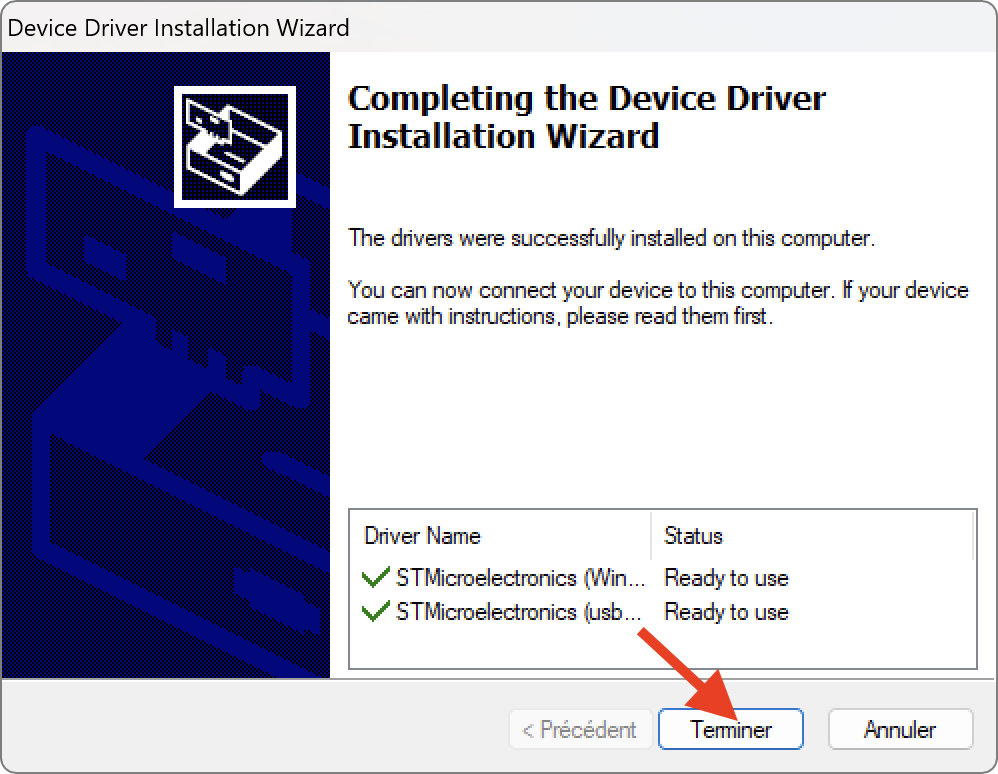
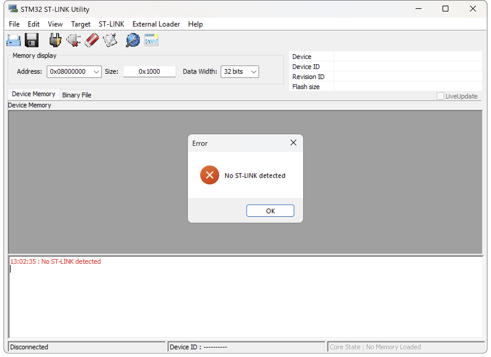
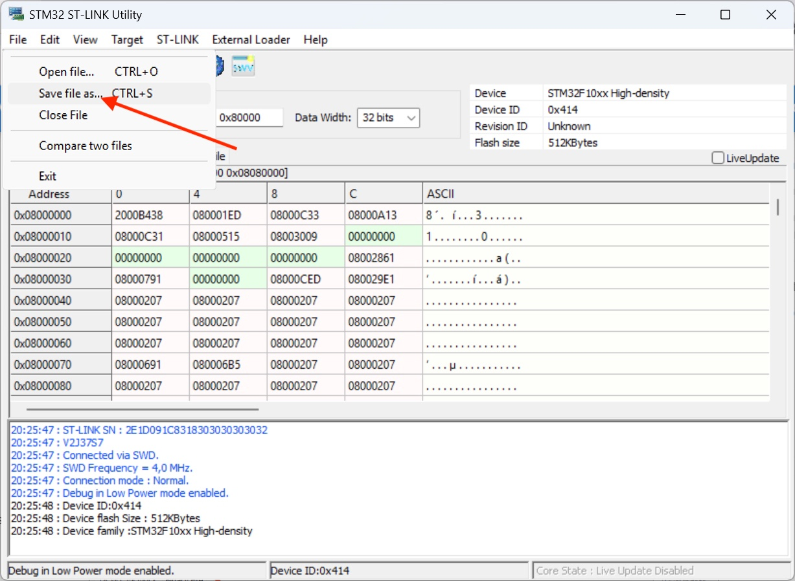
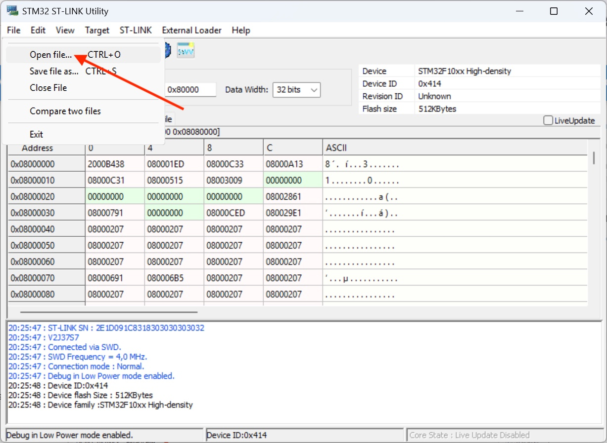

Motherboard firmware needs to be updated to support the latest version of **Klipper**. 
The process explains how to flash the **Klipper** Firmware and the **Katapult** Bootloader (useful for being able to update future Klipper firmwares later).

## Prerequisites

- Combined Katapult Bootloader + Klipper Firmware for Motherboard: <a href="../assets/downloads/firmwares/open-source-edition/motherboard_fw.bin" >:material-download: motherboard_fw.bin</a>
- STM32 ST-LINK Utility (:material-microsoft-windows: Windows only): <a href="../assets/downloads/firmwares/STM32_ST-LINK_Utility_v4.6.0.zip" >:material-download: STM32_ST-LINK_Utility_v4.6.0.zip</a>
- ST-LINK V2 Programmer: <a href="https://www.amazon.fr/Youmile-St-Link-Programme-t%C3%A9l%C3%A9chargement-Programmation/dp/B07QBLNDPM">:simple-amazon: Amazon FR</a> / <a href="https://www.amazon.com/HiLetgo-Emulator-Downloader-Programmer-STM32F103C8T6/dp/B07SQV6VLZ">:simple-amazon: Amazon US</a> / <a href="https://www.amazon.ca/ST-Link-Programming-Emulator-Downloader-Random/dp/B01J7N3RE6">:simple-amazon: Amazon CA</a>
- 4 Dupont cables (usually supplied with the ST-LINK V2 Programmer)

## Install STM32 ST-LINK Utility

!!! Note
    You can skip this step if you have already installed the utility.

- Unzip **`STM32_ST-LINK_Utility_v4.6.0.zip`** file and run **`STM32 ST-LINK Utility v4.6.0.exe`** installer.

- Click on **`Next`** button:

    

- Click on **`Yes`** button:

    

- Click on **`Next`** button:

    

- Click on **`Finish`** button:

    

- A new window appears, click on **`Next`** button to install required drivers:

    

- Then, click on **`Finish`** button:

    

## Connect ST-LINK V2 Programmer

- Make sure your printer is turned off.

- Connect motherboard JTAG pins to ST-LINK V2 Programmer:

      

    !!! Warning
        **Not all STM32 Programmers (especially clones) have the same pin positions. Make sure to match the pins on the SMT32 Programmer with those on the motherboard.**

- Connect the ST-LINK V2 Programmer to a USB port on your computer.

- Start **STM32 ST-LINK Utility** and click on **`Connect to target`** button: 

    

    If you have this message, it means that the Dupont cables are not connected to the right places, check your connections:
    
    

    If you have this message, it means that the drivers for STM32 Programmer are not installed:
    
    

    If you have this message, it means that the memory is protected against read out:
    
    

    Click on **`Target`** → **`Option Bytes`** and set **`Read Out Protection`** parameter to **Disabled**, and then click **`Apply`** button:
    
    

- If the connection is correct, you should get this:

	

## Backup Motherboard Firmware

First of all, it's imperative to backup your motherboard's stock firmware in case you want to restore it.

- When ST-LINK V2 Programmer is connected to motherboard, make sure the **Size** is set to **`0x80000`**

	

- Then, click on **`File`** → **`Save file as...`**:

	

- And save the file on your computer with the name you want and the extension **`.bin`**. The file size should be **512 KB**, which is a full dump.

!!! Note
    If needed, you can download a full dump of FLSUN S1 (not Pro) here: <a href="../assets/downloads/firmwares/stock/motherboard_fw_stock.bin" >:material-download: motherboard_fw_stock.bin</a>

## Flash Bootloader and Klipper Firmware

- When ST-LINK V2 Programmer is connected to motherboard, click on **`File`** → **`Open file...`** and select **`motherboard_fw.bin`** firmware file:

	

- Then, click on **`Program verify`** button:

	

- Make sure this information are the same, click **`Start`** button and wait for the firmware to be written:

	

- If the firmware is written successfully, the following message will appear:

	

- You can now disconnect from target by clicking on **`Disconnect`** button:

	

- You can now unplug the ST-LINK V2 Programmer from your computer and remove Dupont cables from motherboard.

- Next, follow <a href="../insert-microsd-card-with-flsun-os-in-core-board">:material-gesture-tap-button: Insert microSD Card with FLSUN OS in Core Board</a> section.

!!! Note 
    If you want to go back to stock OS you need to reflash your backup firmware.

 

**If you like my work, don't hesitate to support me by paying me a 🍺 or a ☕. Thank you 🙂**

