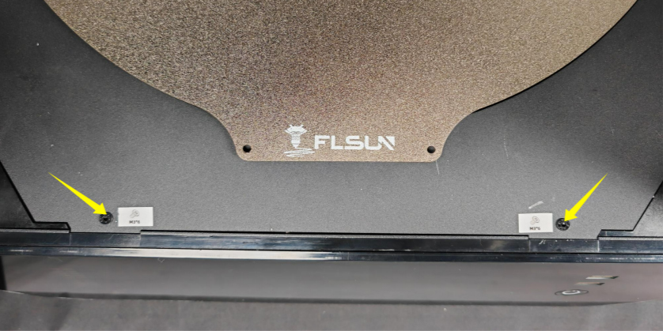
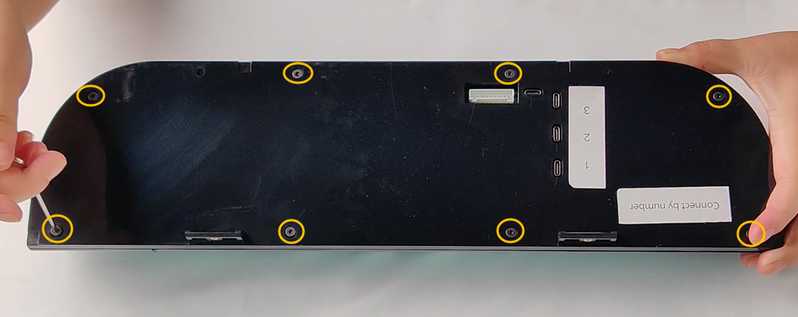

- Make sure the printer is turned off.

- Use the H2.0 Allen wrench in the accessory box to remove the screws from the top cover of the printer.

- Use the H2.0 Allen wrench in the accessory box to remove the screws above the screen:

    

- Use the H3.0 Allen wrench in the accessory box to remove the screws under the screen:

    

 
- Unplug the display power cord and three data cables:

    

 
- Use the H2.0 Allen wrench in the accessory box to remove the eight screws on the back cover of the screen, and disassemble the back cover of the screen:

    

- Insert your microSD card into the port here:

    

    
 
- You can now screw the screen box back on, reconnect the cables and reattach it to the printer.

    !!! Warning
        **To avoid issues with camera detection, do not reconnect the cable from the USB 1 port**, it is for the cameras on the hotend which are not used.  
        You can also remove them from the effector to save a little weight: 
        

- Next, follow <a href="../first-boot">:material-power-settings: First Boot</a> section.

 

**If you like my work, don't hesitate to support me by paying me a 🍺 or a ☕. Thank you 🙂**

