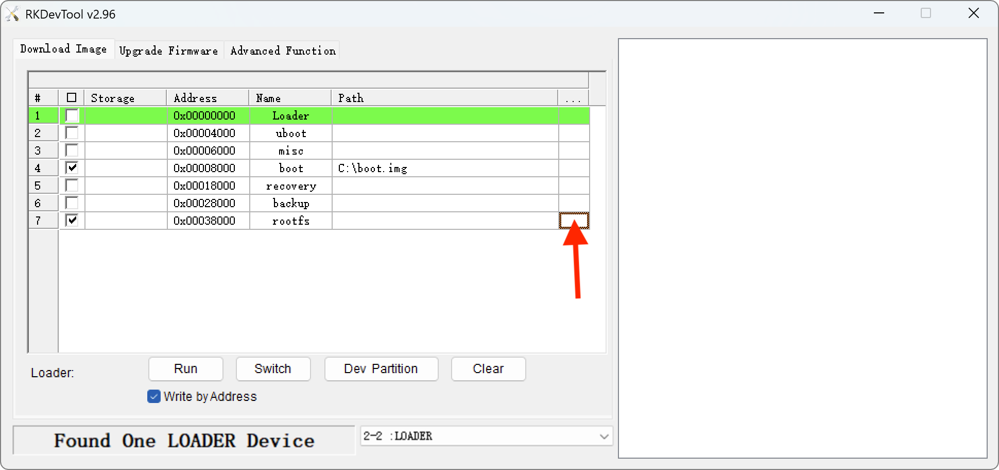
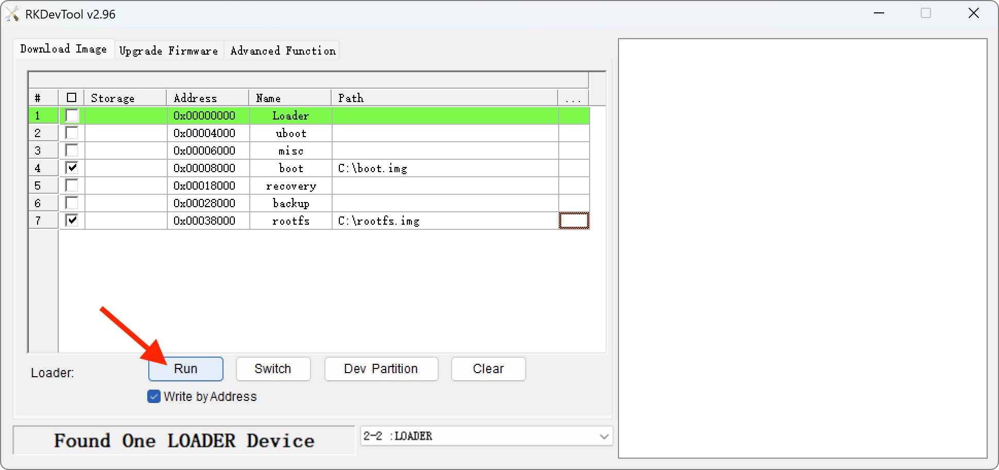

This process installs FLSUN OS on the core board's eMMC memory.

<br />

What are the advantages over microSD?<br />
The eMMC offers faster read and write speed and is less prone to physical corruption. It is known to be more robust and durable than SD cards as it can withstand more write cycles before failing.

<br />

!!! Warning
    **This is intended only for advanced users who are no longer using the Stock OS.**<br />
    **Any mishandling can render your core board unusable!**<br />
    **Only use this procedure if you know what you are doing. I will not be responsible if something goes wrong.**<br />
    **It's better to make a backup of your rootfs partition before.**<br /><br />
    If needed, here is a full backup of eMMC with Stock OS 1.0.6.4: <a href="https://drive.google.com/file/d/14JhpC56aXe_kKlerZf43JvFv31ULlQqN/view?usp=sharing">:material-google-drive: STOCK-OS-S1-EMMC-1.0.6.4.7z</a><br />
    This can restore a bricked core board.


## Backup eMMC
<hr>

- First, it's necessary to boot **FLSUN OS** from the microSD card.

    See <a href="../prepare-microsd-card-for-flsun-os">:material-micro-sd: Prepare microSD Card for FLSUN OS</a> section.

- When **FLSUN OS** is ready, plug a USB drive of at least **`32 GB`** formatted in **`exFAT`** into one of the printer's USB ports.

- Connect to printer over SSH (see <a href="../ssh-connection">:material-console: SSH Connection</a> section).

- In the SSH command prompt window, enter the following commands (one at a time) to backup each partition on USD drive:

    ``` title="SSH Command Prompt - Backup uboot.img"
    sudo dd if=/dev/mmcblk0p1 of=/home/pi/printer_data/gcodes/USB-DISK-1/uboot.img status=progress bs=1M
    ```
    ``` title="SSH Command Prompt - Backup misc.img"
    sudo dd if=/dev/mmcblk0p2 of=/home/pi/printer_data/gcodes/USB-DISK-1/misc.img status=progress bs=1M
    ```
    ``` title="SSH Command Prompt - Backup boot.img"
    sudo dd if=/dev/mmcblk0p3 of=/home/pi/printer_data/gcodes/USB-DISK-1/boot.img status=progress bs=1M
    ```
    ``` title="SSH Command Prompt - Backup recovery.img"
    sudo dd if=/dev/mmcblk0p4 of=/home/pi/printer_data/gcodes/USB-DISK-1/recovery.img status=progress bs=1M
    ```
    ``` title="SSH Command Prompt - Backup backup.img"
    sudo dd if=/dev/mmcblk0p5 of=/home/pi/printer_data/gcodes/USB-DISK-1/backup.img status=progress bs=1M
    ```
    ``` title="SSH Command Prompt - Backup rootfs.img"
    sudo dd if=/dev/mmcblk0p6 of=/home/pi/printer_data/gcodes/USB-DISK-1/rootfs.img status=progress bs=1M
    ```
    ``` title="SSH Command Prompt - Backup mmc.img"
    sudo dd if=/dev/mmcblk0 of=/home/pi/printer_data/gcodes/USB-DISK-1/mmc.img status=progress bs=1M
    ```

- When it's done, you can remove the USB drive and keep your backup images safe.

- Also remember to remove the microSD card after turning off the printer.


## Prerequisites
<hr>

- 1 x USB-A to USB-C cable

- **RKDevTool** (:material-microsoft-windows: Windows only): <a href="../assets/downloads/firmwares/RKDevTool_Release_v2.96.zip">RKDevTool_Release_v2.96.zip</a>

- **Rockchip** driver (:material-microsoft-windows: Windows only): <a href="../assets/downloads/firmwares/DriverAssitant_v5.0.zip">DriverAssitant_v5.0.zip</a>

- **FLSUN OS** image (EMMC version): <a href="https://github.com/Guilouz/FLSUN-S1-Open-Source-Edition/releases">:material-download: Download</a>


## Install Driver
<hr>

- Unzip **`DriverAssitant_v5.0.zip`** file and run **`DriverInstall.exe`** installer.

- Click on **`Install Driver`** button:

    


- If Windows asks you to confirm the installation, accept.

- Once finished, you can exit the installer:

    


## Write Image
<hr>

- Make sure the printer is turned off.

- Use the H2.0 Allen wrench in the accessory box to remove the screws from the top cover of the printer.

- Use the H2.0 Allen wrench in the accessory box to remove the screws above the screen:

    


- Use the H3.0 Allen wrench in the accessory box to remove the screws under the screen:

    

 
- Unplug the display power cord and three data cables:

    

 
- Use the H2.0 Allen wrench in the accessory box to remove the eight screws on the back cover of the screen, and disassemble the back cover of the screen:

    

- Use the H2.0 Allen wrench to remove the four screws on the screen core board:

    


- Connect the USB cable to the **USB-C 1** port on the core board:

    


- Unzip **`RKDevTool_Release_v2.96.zip`** file and run **`RKDevTool.exe`** installer:

    


- Unzip **FLSUN OS** image (EMMC version).

- Connect the USB cable to your computer.

- Locate the buttons on the core board and turn on the printer:

    


-  Perform this combination to enter in USB Mode:

    Hold **`BOOT9200`** button → Press **`BOOT2100`** button → Release **`BOOT9200`** button


- **RKDevTool** should display **`Found One LOADER Device`**:

    


- Check the  **`Write by Address`** box and click on the rectangle at the **`boot`** line to select the **boot.img** file previously unzipped:

    


- Click on the rectangle at the **`rootfs`** line to select the **rootfs.img** file previously unzipped:

    


- Once images are selected, click on the **`Run`** button:

    


- Wait for the image to be written, this takes several minutes.

- Once completed, the core board reboots to load the OS:

    


- Wait for the OS to fully load, until **KlipperScreen** is displayed.

- You can now turn off the printer, screw the screen box back on, reconnect the cables and reattach it to the printer.

- Now you have FLSUN OS installed on the eMMC and it is still possible to boot from a microSD card if needed.

<br />

**If you like my work, don't hesitate to support me by paying me a 🍺 or a ☕. Thank you 🙂**

<a href="https://ko-fi.com/guilouz" target="_blank"></a>
