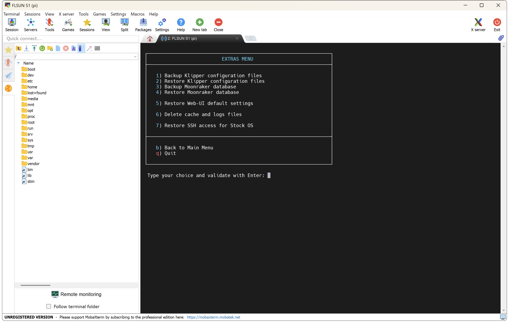

The Open Source OS is already ready to use for the FLSUN S1 Stock version but other Klipper configuration sets are available:

  - **Stock (without Silent Kit)** → for FLSUN S1 Stock (configuration loaded by default)
  - **Stock (with Silent Kit)** → for FLSUN S1 with Silent Kit (CPAP less noisy)
  - **MMB Cubic (without Silent Kit)** → for FLSUN S1 Stock and the use of <a href="../bigtreetech-mmb-cubic">MMB Cubic</a>
  - **MMB Cubic (with Silent Kit)** → for FLSUN S1 with Silent Kit  and the use of <a href="../bigtreetech-mmb-cubic">MMB Cubic</a>

<br />

- To set the configurations to use, connect to printer over SSH (see <a href="../ssh-connection">:material-console: SSH Connection</a> section).

- In the SSH command prompt window, enter the following command to start **Easy Installer**:

	``` title="SSH Command Prompt"
	easy-installer
	```

	

- Enter ++"3"++ for **Extras** menu → ++"1"++ for **Set Klipper configuration to use** → ++"Enter"++ to confirm your choice:

	

- Select the configuration you want and ++"Enter"++ to confirm your choice::

	

- The chosen configuration will be automatically applied.

!!! Note
    If needed, all Klipper configuration files are available <a href="https://github.com/Guilouz/Klipper-Flsun-S1/tree/master/config">here</a>.

<br />

**If you like my work, don't hesitate to support me by paying me a 🍺 or a ☕. Thank you 🙂**

<a href="https://ko-fi.com/guilouz" target="_blank"></a>
