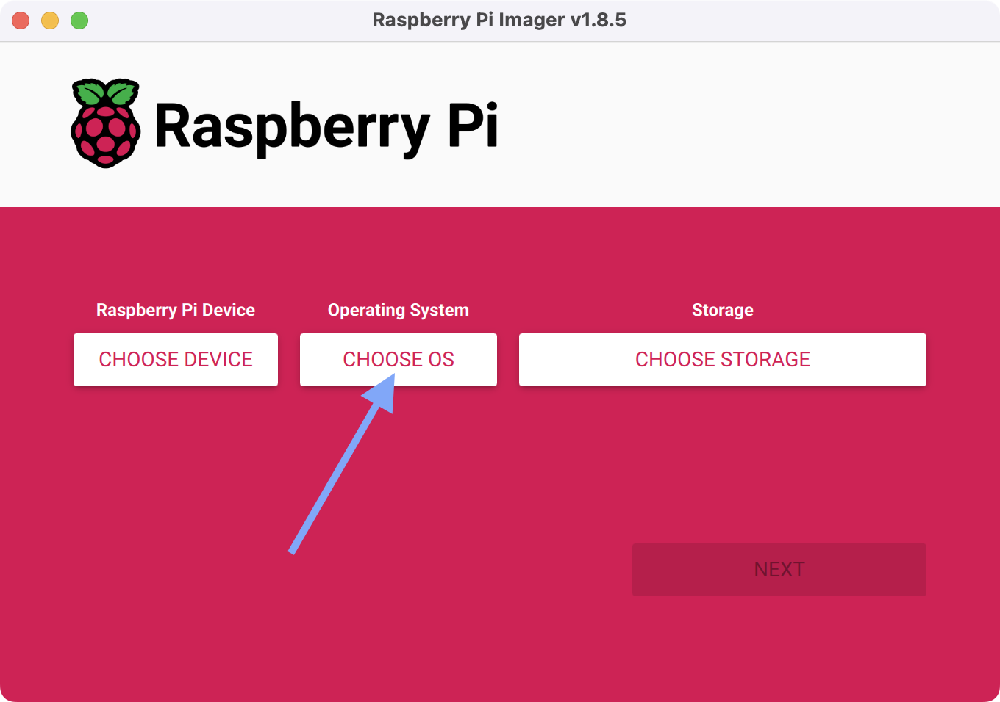
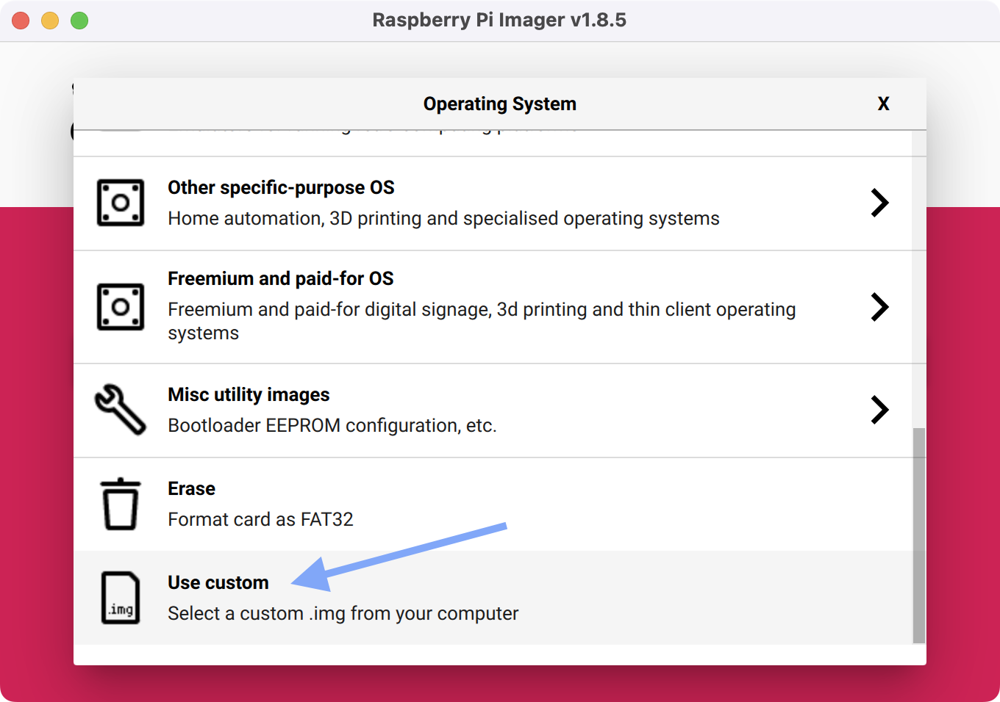
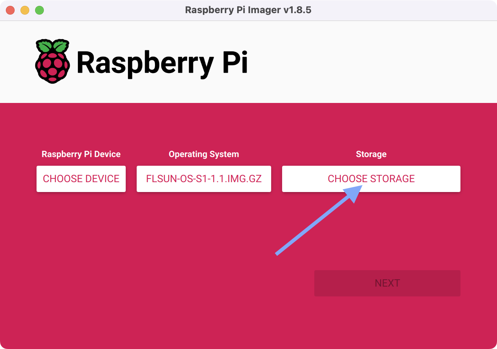
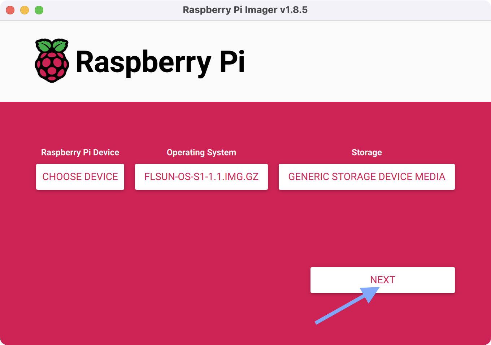
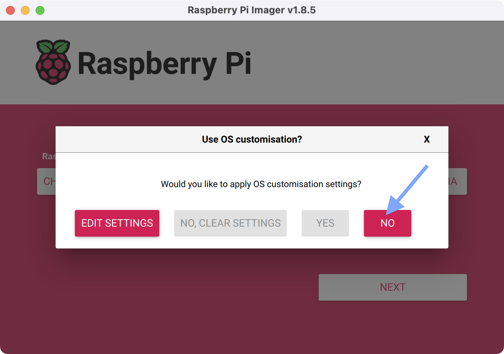
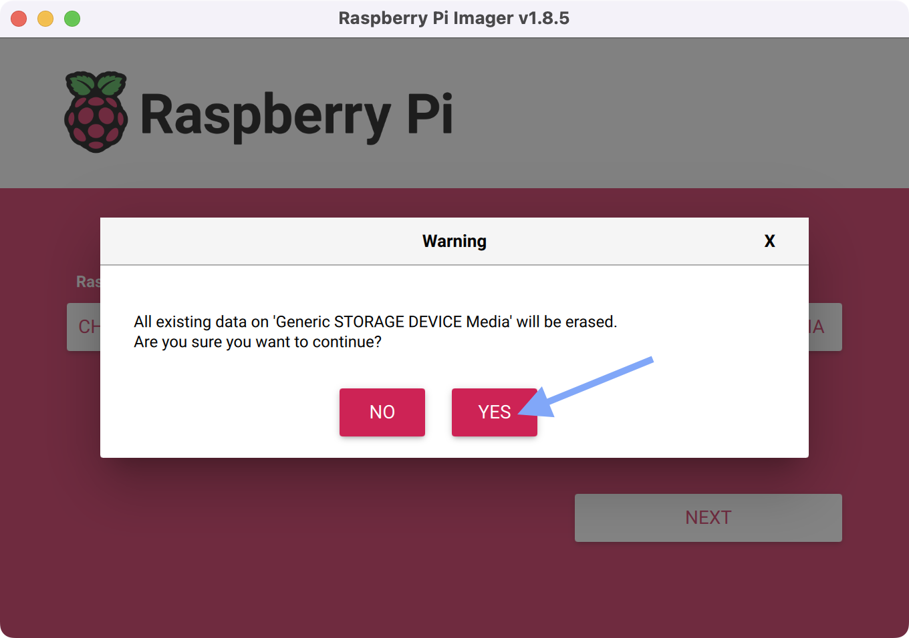
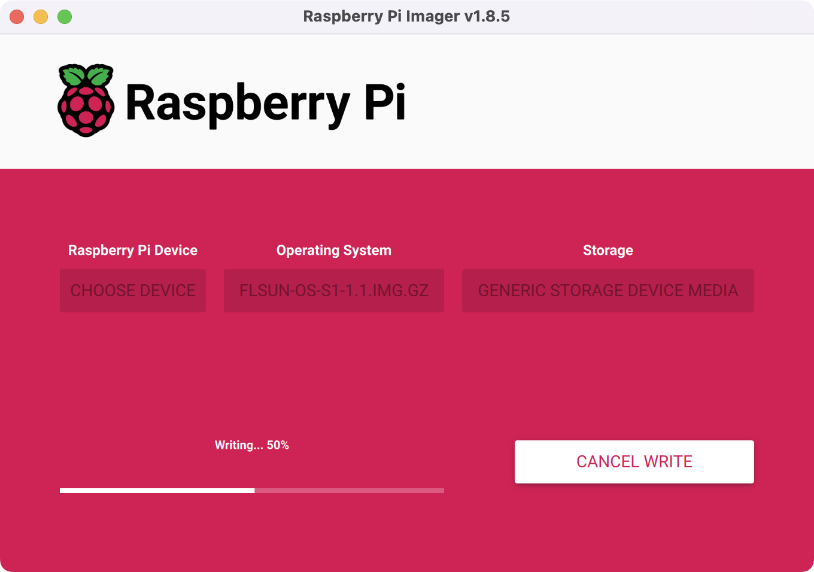
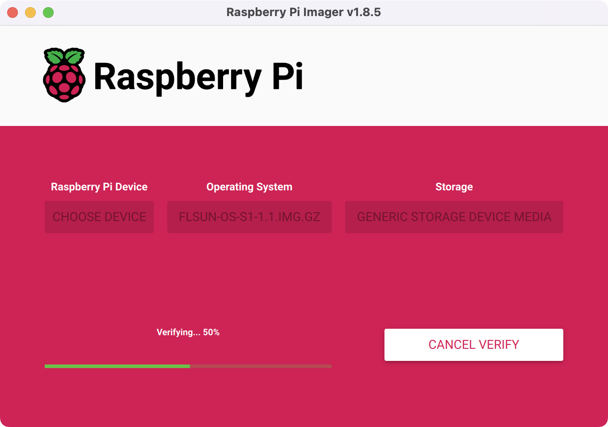
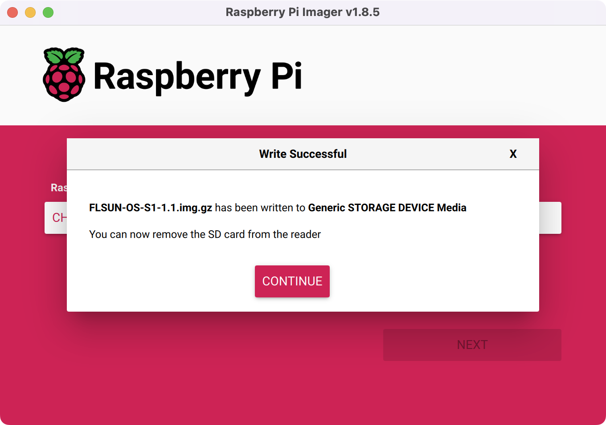

## Prerequisites

- microSD card with a minimum size of 16GB (I recommend _SanDisk Extreme PRO_)

- **Raspberry Pi Imager**: <a href="https://www.raspberrypi.com/software/">:material-download: Download</a>

- **FLSUN OS** image: <a href="https://github.com/Guilouz/FLSUN-S1-Open-Source-Edition/releases">:material-download: Download</a>

## Prepare microSD

- Insert the microSD card into your computer.

- Start **Raspberry Pi Imager**.

- Click on **`CHOOSE OS`** button:

    

- Click on **`Use Custom`** button and select **FLSUN OS** image file (with the extension **.gz**):

    

- Click on **`CHOOSE STORAGE`** button and select your microSD card storage:

    

- Click on **`NEXT`** and select your microSD card storage:

    

- When asked if you would like to apply OS customisation settings, click on **`NO`** button:

    

- Then confirm by clicking on **`YES`** button:

    

- Wait until the writing is completed:

    

- Then wait for the verification to complete:

    

- Your microSD card is ready, you can remove it from your computer:

    

- Next, follow <a href="../prepare-microsd-card-for-motherboard-firmware">:material-micro-sd: Prepare microSD Card for Motherboard Firmware</a> section.

 

**If you like my work, don't hesitate to support me by paying me a 🍺 or a ☕. Thank you 🙂**

