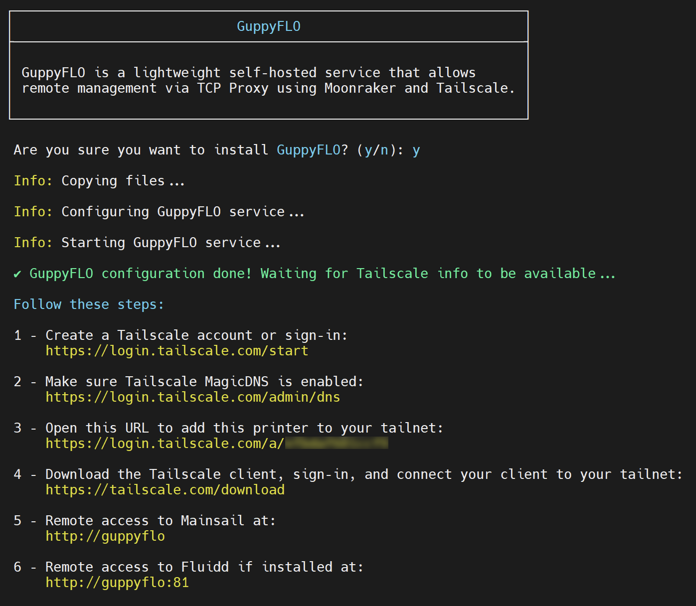
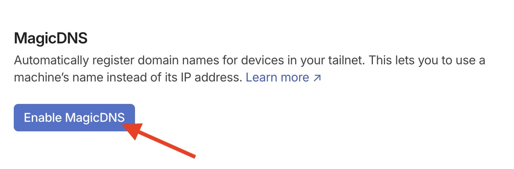
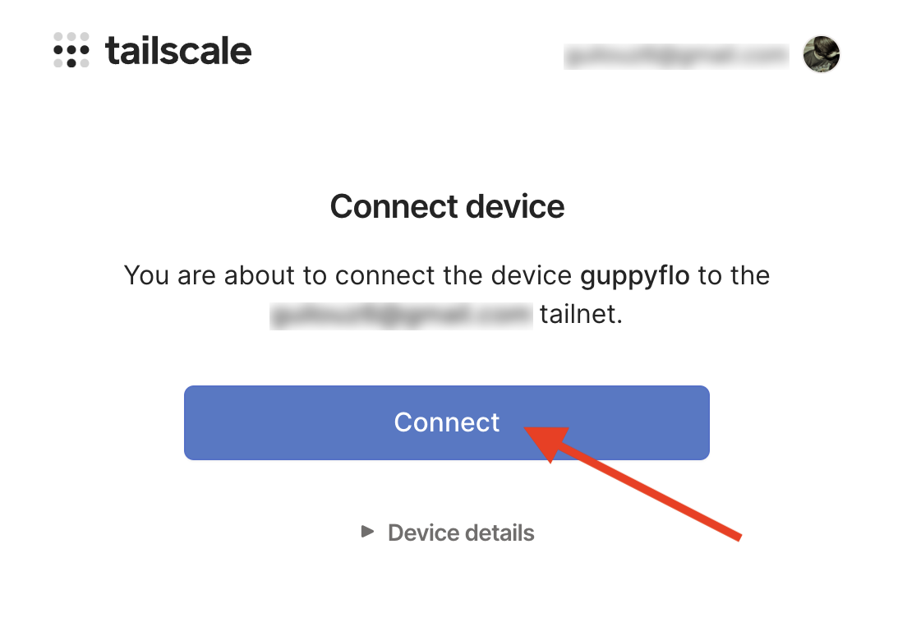
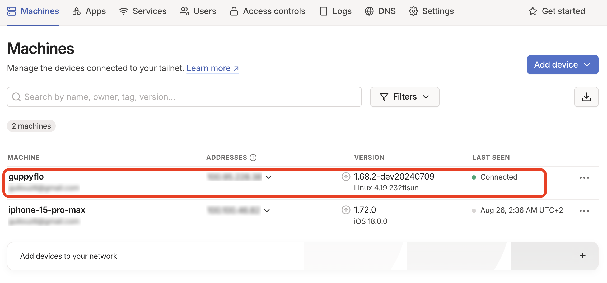
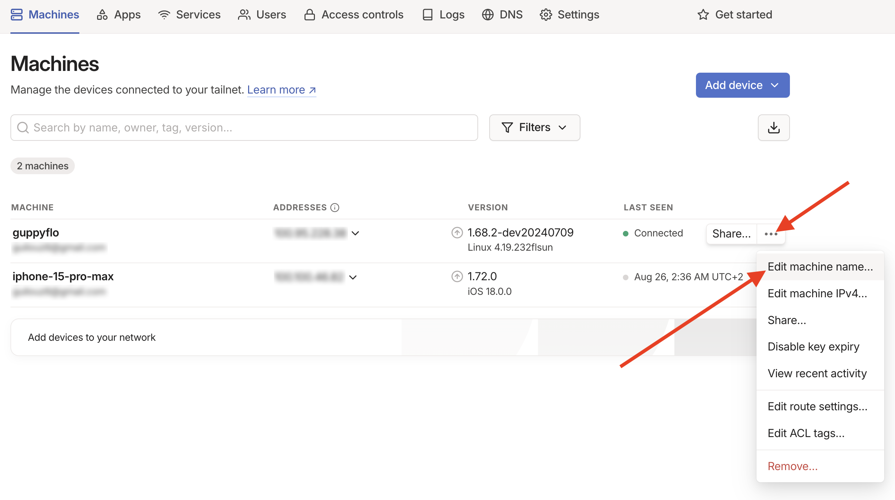
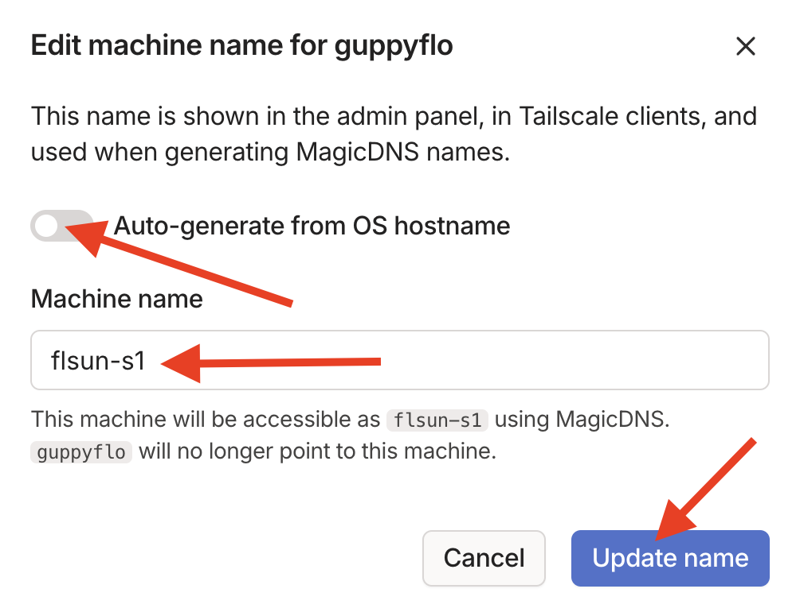
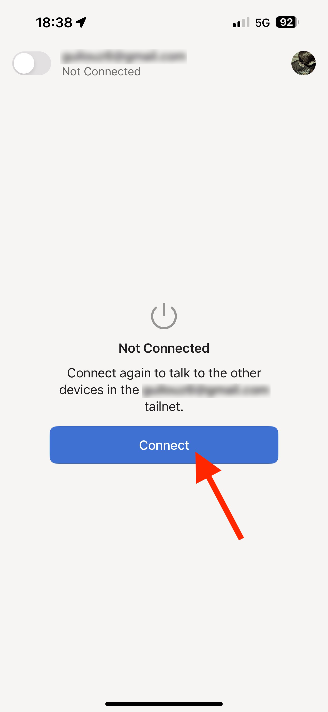
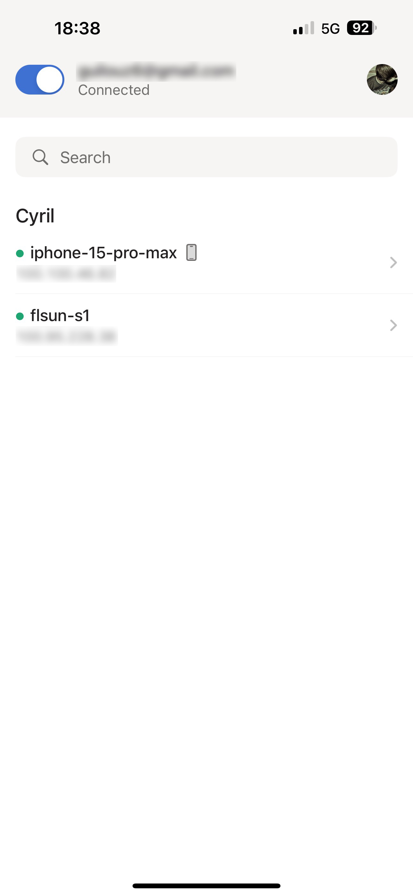
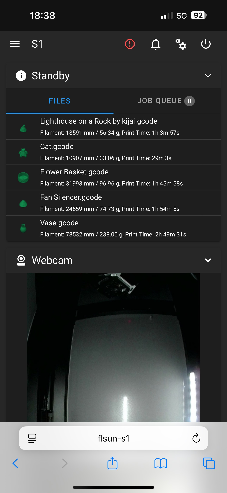
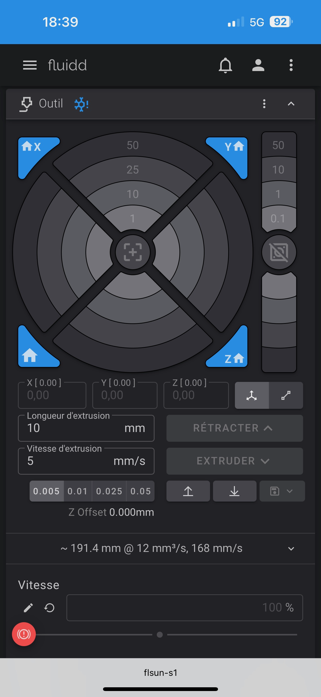

**GuppyFLO** is a lightweight self-hosted service that allows remote management via TCP Proxy using Moonraker and Tailscale.<br />
It allows you to access your printer outside your local network in a secure way.

### Install GuppyFLO
<hr>

- Connect to printer over SSH (see <a href="../ssh-connection">:material-console: SSH Connection</a> section).

- In the SSH command prompt window, enter the following command to start **Easy Installer**:

	``` title="SSH Command Prompt"
	easy-installer
	```

	

- Enter ++"1"++ for **Install** menu → ++"2"++ for **Install GuppyFLO** → ++"Enter"++ to confirm your choice:

	


- After installation you get this:

	

- Then go to this address to connect to your **Tailscale** account or create one:<br /><a href="https://login.tailscale.com/start">:material-web: https://login.tailscale.com/start</a>

- Once logged in, go to this address and enable the **`MagicDNS`** feature:<br /><a href="https://login.tailscale.com/admin/dns">:material-web: https://login.tailscale.com/admin/dns</a>

	

- You can now connect your printer to your Tailscale account by going to the address given in **Step 3** and clicking the **`Connect`** button:

	

- On your **Tailscale** dashboard you can now see your connected printer:

	

- You can change the name of the printer (the name corresponds to the url you will access to connect remotely):

	

- Disable **`Auto-generate from OS hostname`**, enter the desired name and click on **`Update name`** button:

	

- Now install the **Tailscale** client on the device from which you want to access your printer by going to this address: <a href="https://tailscale.com/download">:material-web: https://tailscale.com/download</a>

- Sign-in and connect your client to your **Tailscale** account (here I use my mobile):

	&nbsp;&nbsp;&nbsp;&nbsp;&nbsp;

- You can now remotely connect to your printer with the following addresses:

	You can access to **Mainsail** with **`http://gyppyflo/`** (by default) or with your custom hostname, here: **`http://flsun-s1/`**.<br>
	You can access to **Fluidd** with **`http://guppyflo:81/`** (by default) or with your custom hostname, here: **`http://flsun-s1:81/`**.

	| Mainsail | Fluidd |
	| :---------: | :---------: |
	|  |  |


### Remove GuppyFLO
<hr>

- Connect to printer over SSH (see <a href="../ssh-connection">:material-console: SSH Connection</a> section).

- In the SSH command prompt window, enter the following command to start **Easy Installer**:

	``` title="SSH Command Prompt"
	easy-installer
	```

	


- Enter ++"2"++ for **Remove** menu → ++"2"++ for **Remove GuppyFLO** → ++"Enter"++ to confirm your choice:

	

<br />

**If you like my work, don't hesitate to support me by paying me a 🍺 or a ☕. Thank you 🙂**

<a href="https://ko-fi.com/guilouz" target="_blank"></a>
