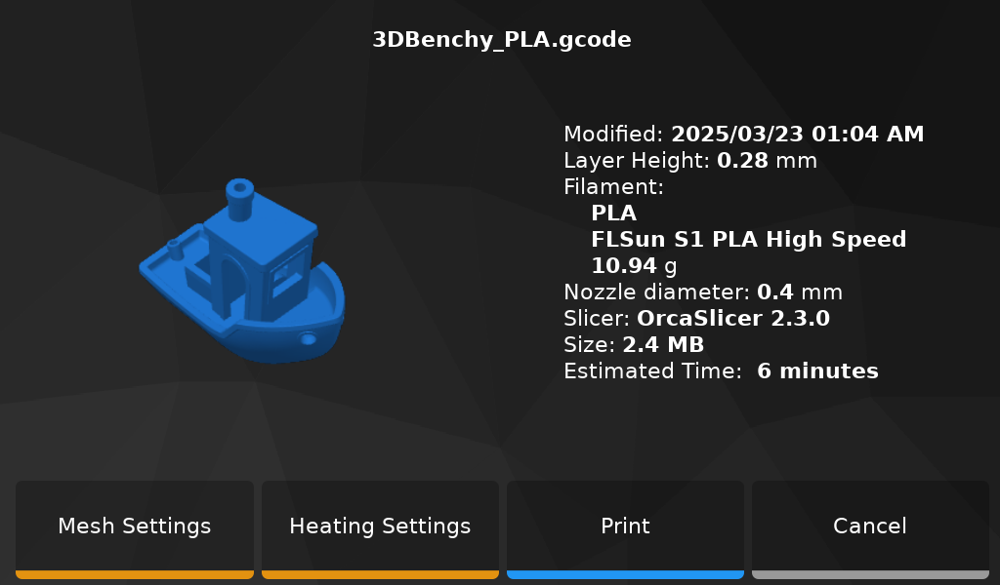
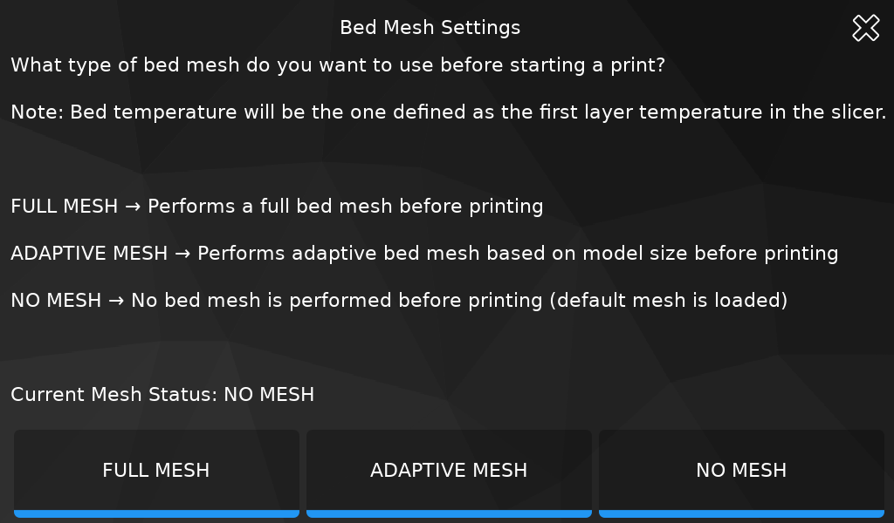
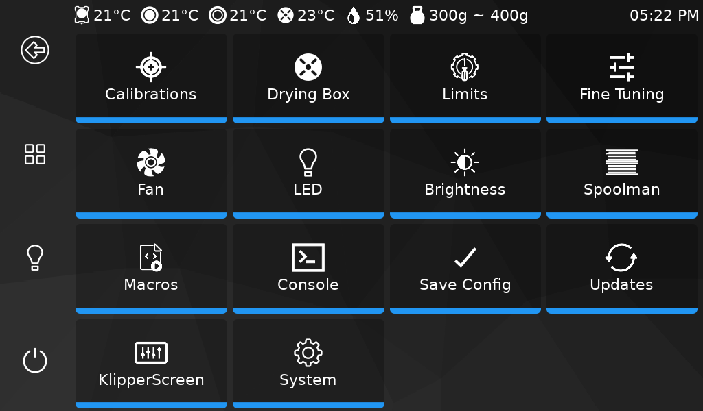
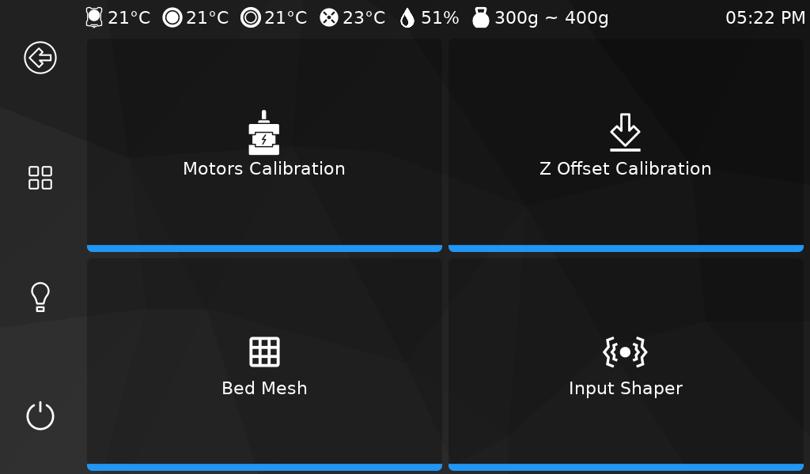
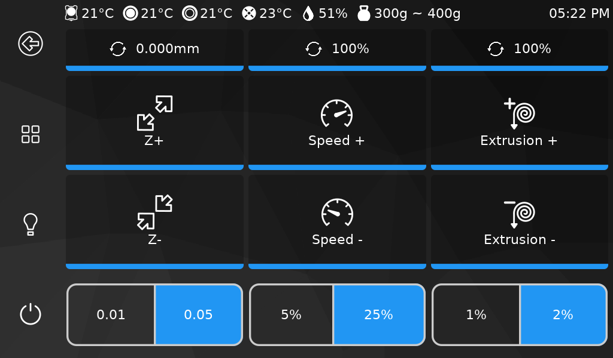

- **Main Menu**

	

- **Move Panel**

	

- **Temperature Panel**

	

- **Filament Panel**

	

- **Unload Panel**

	

- **Print Panels**

	

	

- **Bed Mesh Settings Panel**

	

- **Configurations Panel**

	

- **Calibrations Panel**

	

- **Drying Box Panels**

	

	

	

- **Limits Panel**

	

- **Fine Tune Panel**

	

- **Fan Panel**

	

- **Macros Panel**

	

- **LED Panel**

	

- **Spoolman Panel**

	

- **Brightness Panel**

	

- **Shutdown Panel**

	

 

**If you like my work, don't hesitate to support me by paying me a 🍺 or a ☕. Thank you 🙂**

