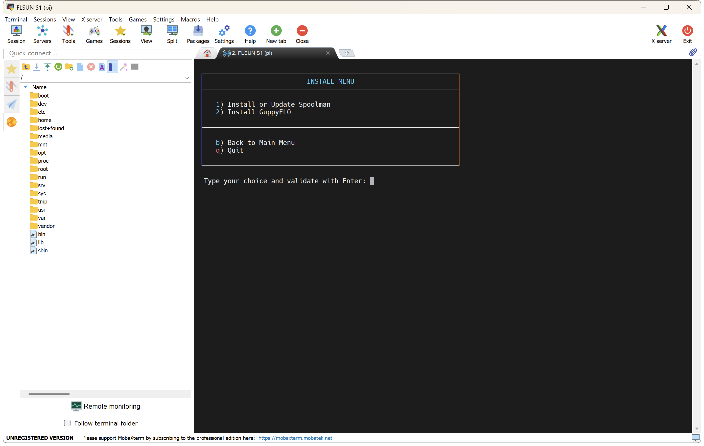
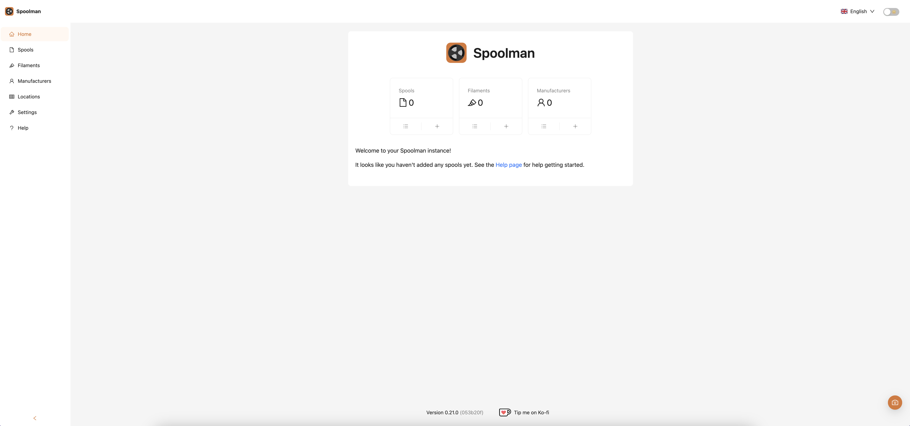
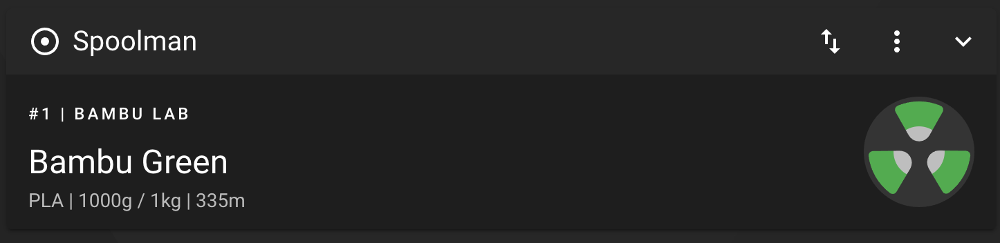
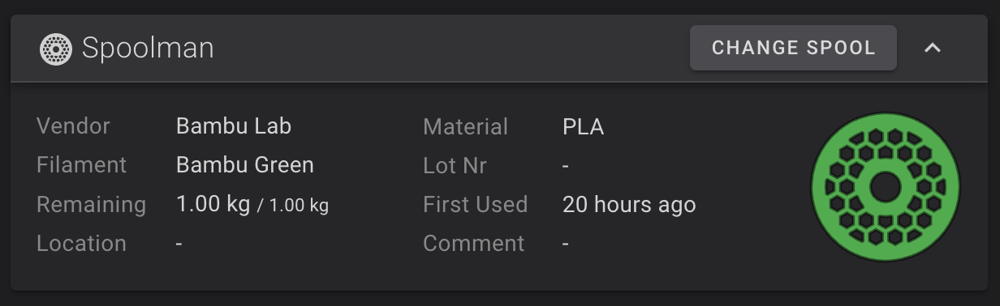
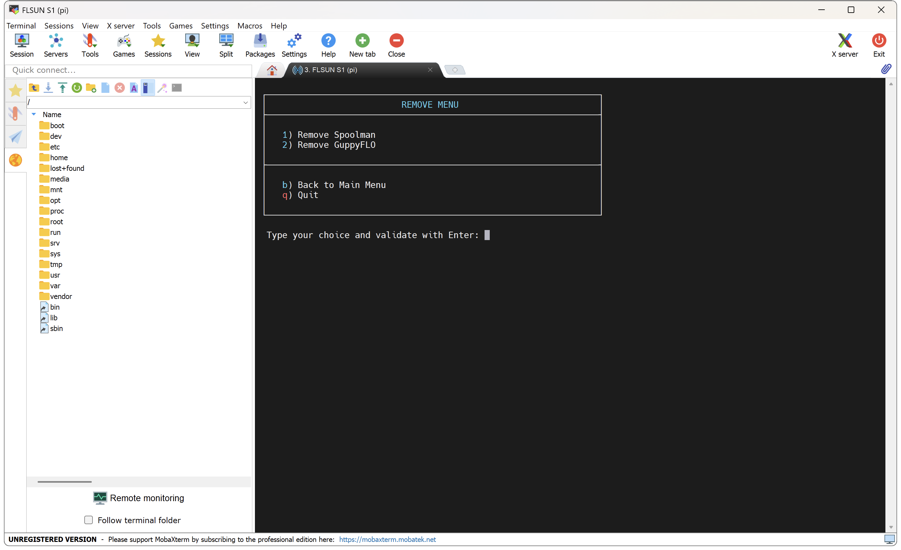

**Spoolman** is a self-hosted web service designed to help you efficiently manage your 3D printer filament spools and monitor their usage.

### Install Spoolman
<hr>

- Connect to printer over SSH (see <a href="../ssh-connection">:material-console: SSH Connection</a> section).

- In the SSH command prompt window, enter the following command to start **Easy Installer**:

	``` title="SSH Command Prompt"
	easy-installer
	```

	

- Enter ++"1"++ for **Install** menu → ++"1"++ for **Install or Update Spoolman** → ++"Enter"++ to confirm your choice:

	

- The installation takes some time, once completed you can access the **Spoolman** Web interface at this address:

	**`http://xxx.xxx.xxx.xxx:7912/`** (replacing **xxx.xxx.xxx.xxx** by your local IP address)
	
	


- You can also manage **Spoolman** on Mainsail and Fluidd:

	| Mainsail |
	| :---------: |
	|  |

	| Fluidd |
	| :---------: |
	|  |


!!! Note
	You can update **Spoolman** to a newer version by reinstalling it without having to remove it first.<br />
	Updating keeps your existing database.


### Remove Spoolman
<hr>

- Connect to printer over SSH (see <a href="../ssh-connection">:material-console: SSH Connection</a> section).

- In the SSH command prompt window, enter the following command to start **Easy Installer**:

	``` title="SSH Command Prompt"
	easy-installer
	```

	


- Enter ++"2"++ for **Remove** menu → ++"1"++ for **Remove Spoolman** → ++"Enter"++ to confirm your choice:

	

- Installer will ask you if you want to keep or delete your database (in case you want to reinstall it later).

<br />

**If you like my work, don't hesitate to support me by paying me a 🍺 or a ☕. Thank you 🙂**

<a href="https://ko-fi.com/guilouz" target="_blank"></a>
