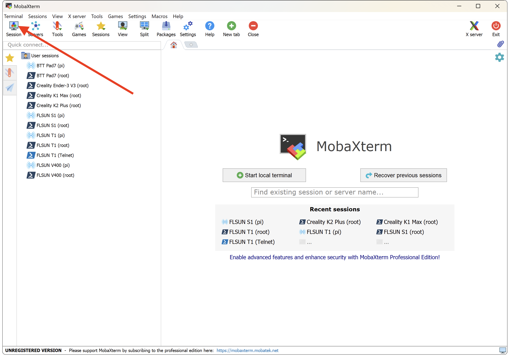
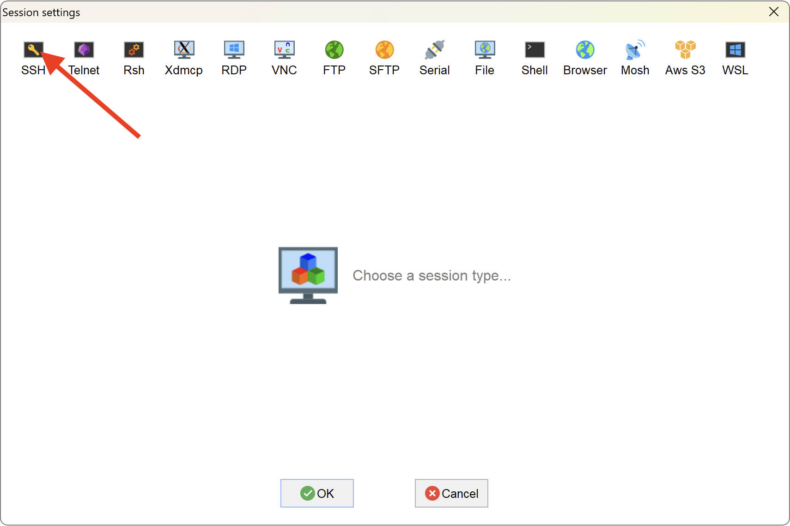
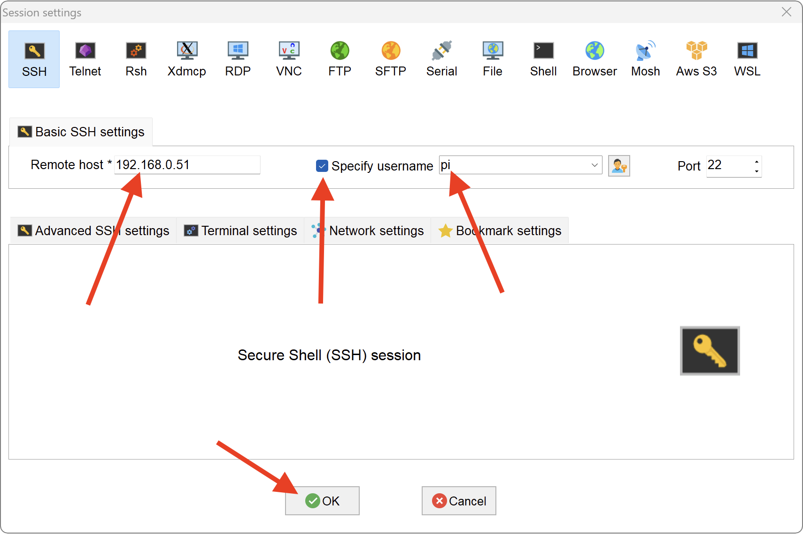
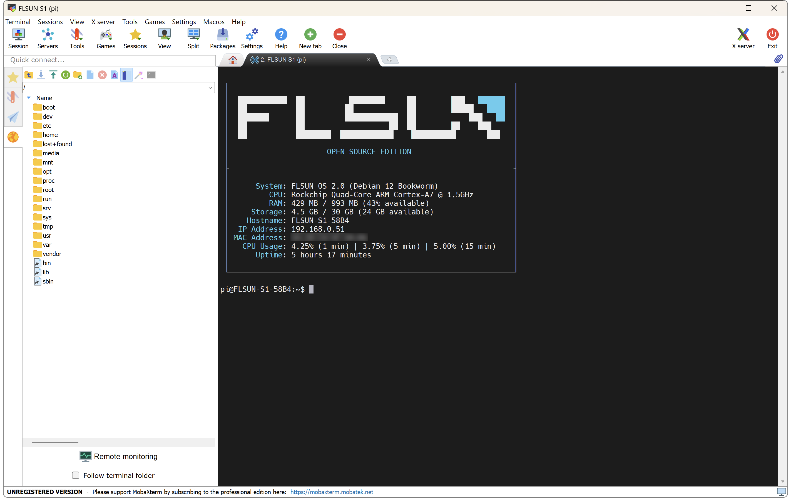

- Download and install the **MobaXterm** software: <a href="https://mobaxterm.mobatek.net/download-home-edition.html">:material-web: Download</a>

- Launch it then click on the **`Session`** icon:

	

-	Then on then **`SSH`** icon:

    
 
-	Enter the IP address of your printer in the **`Remote Host`** field, check the **`Specify username`** box and enter the username **`pi`** in the field then click on **`OK`**:

    

- On the new displayed window, enter the password **`flsun`** (it's not displayed when typing, this is normal).

- An authorization window will appear, authorize it. It's also possible that another window asking you to change the password will appear, ignore it.

- Once connected, on the left part of the window you have access to the folders and files of your printer and on the right part to the SSH command prompt window:

    

!!! Note
    You can access via SSH with these credentials: 
    - root → flsun 
    - pi → flsun

 

**If you like my work, don't hesitate to support me by paying me a 🍺 or a ☕. Thank you 🙂**

