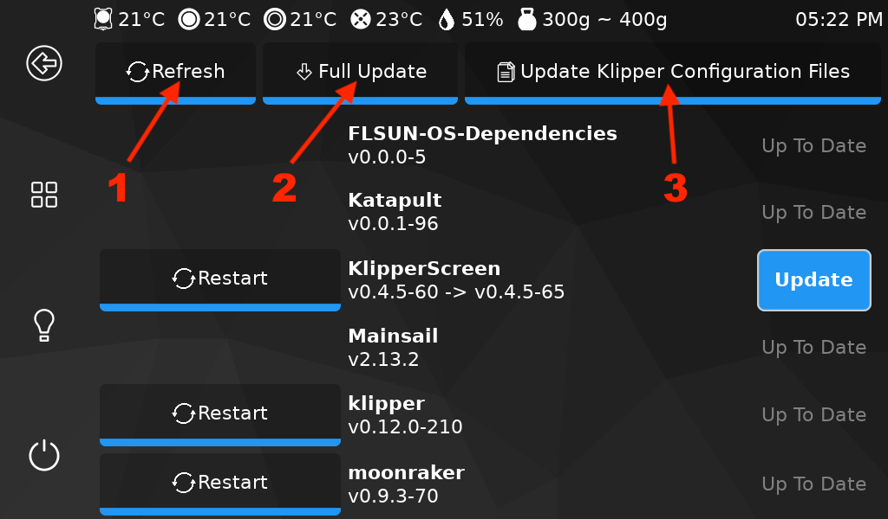
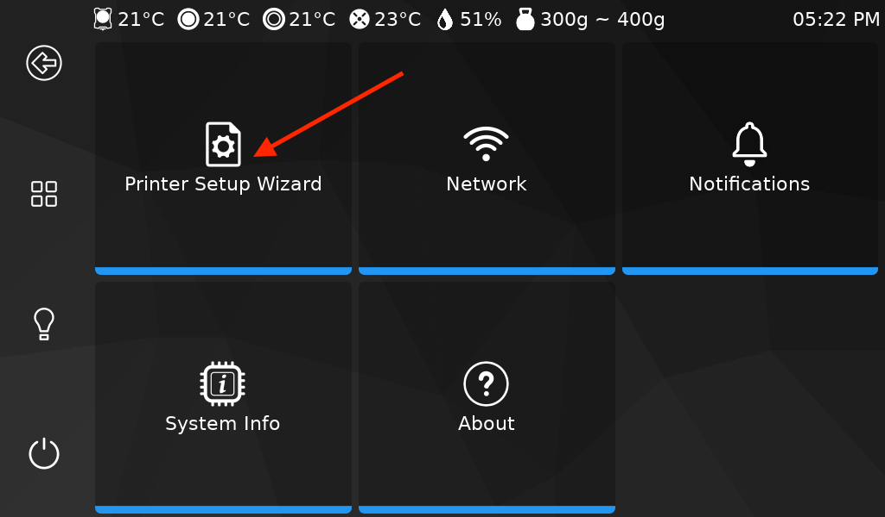
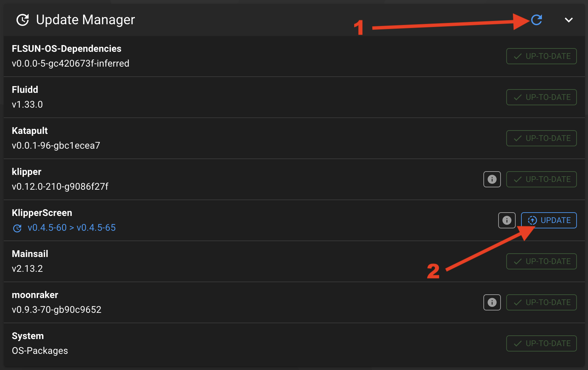
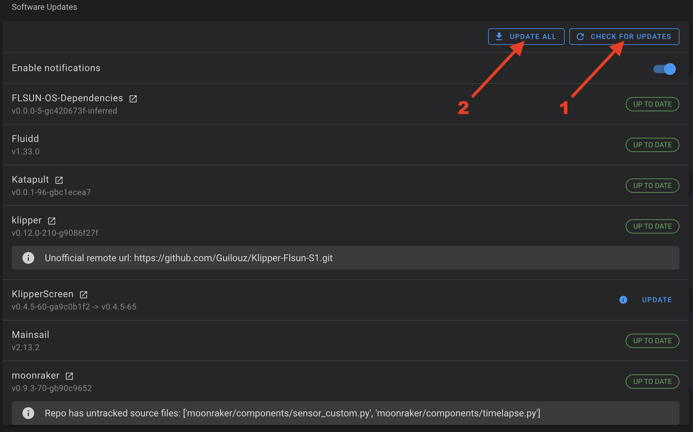
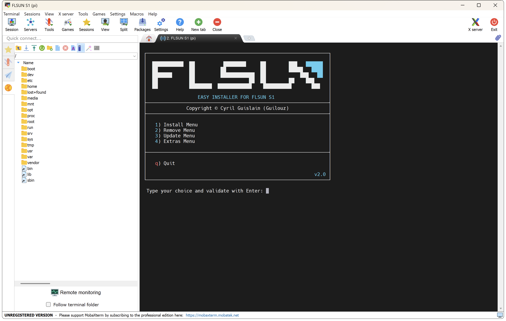
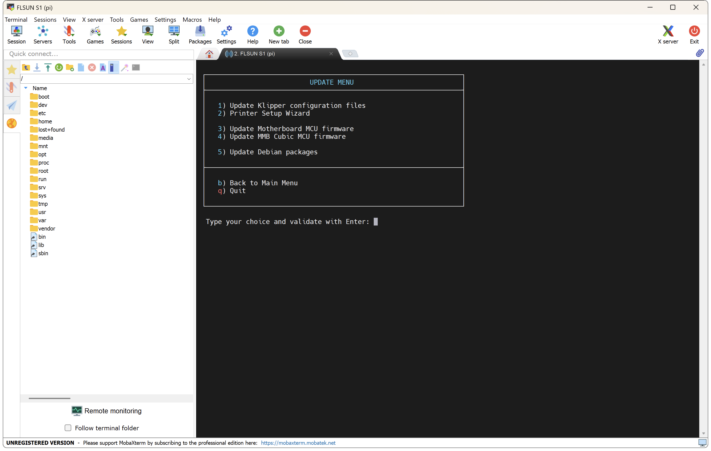

The Open Source OS is already ready to use and configured for the FLSUN S1 Stock version but you need to configure it if you use Silent Fan Upgrade Kit (CPAP less noisy) or S1 Pro.

<br />

To update to the latest builds, Klipper configuration files and configure your printer, you have 3 possibilities.

### From KlipperScreen
<hr>

- Go to the **`Configurations`** → **`Updates`** menu:

	

- Click on **`Refresh`** button to check for available updates.

- Click on **`Full Update`** button to update if updates are available.

- Click on **`Update Klipper Configuration Files`** button to update Klipper configuration files.

- Then, go to the **`Configurations`** → **`System`** menu and click on **`Printer Setup Wizard`** button to configure features you need:

	

- After that, **don't forget to calibrate your printer before starting a print!**:

    Go to the **`Configurations`** → **`Calibrations`** menu.
    
    - **Motors Calibration** → To calibrate Motors
    - **Z Offset Calibration** → To calibrate Z Offset
    - **Bed Mesh** → To perform Delta Calibration and Bed Leveling
    - **Input Shaper** → To measure Resonances

- Enjoy :smiley:


### From Mainsail or Fluidd
<hr>

- Access to **`Update Manager`**:

    - On **Mainsail** Web Interface go to **`MACHINE`** tab on the left side.
    - On **Fluidd** Web Interface go to **`Settings`** icon → **`Software Updates`** tab  on the left side.

- Click the refresh button and update all the versions that can be updated:

	| Mainsail | Fluidd |
	| :---------: | :---------: |
	|  |  |

- Next, run **`UPDATE_CONFIGURATION_FILES`** macro to update Klipper configuration files.

- And then, run **`PRINTER_SETUP_WIZARD`** macro to configure features you need.

- After that, **don't forget to calibrate your printer before starting a print!**:

    Go to the **`Configurations`** → **`Calibrations`** menu.
    
    - **Motors Calibration** → To calibrate Motors
    - **Z Offset Calibration** → To calibrate Z Offset
    - **Bed Mesh** → To perform Delta Calibration and Bed Leveling
    - **Input Shaper** → To measure Resonances

- Enjoy :smiley:


### From SSH with Easy Installer
<hr>

- Connect to printer over SSH (see <a href="../ssh-connection">:material-console: SSH Connection</a> section).

- In the SSH command prompt window, enter the following command to start **Easy Installer**:

	``` title="SSH Command Prompt"
	easy-installer
	```

	


- Enter ++"3"++ for **Update** menu → ++"Enter"++ to confirm your choice:

	


- Enter ++"1"++ for **Update Klipper configuration files** → ++"Enter"++ to confirm your choice and configuration files will be updated.

- Then, enter ++"2"++ for **Printer Setup Wizard** → ++"Enter"++ to confirm your choice and configure features you need.

- After that, **don't forget to calibrate your printer before starting a print!**:

    Go to the **`Configurations`** → **`Calibrations`** menu.
    
    - **Motors Calibration** → To calibrate Motors
    - **Z Offset Calibration** → To calibrate Z Offset
    - **Bed Mesh** → To perform Delta Calibration and Bed Leveling
    - **Input Shaper** → To measure Resonances

- Enjoy :smiley:


!!! Note
    If needed, all Klipper configuration files are available <a href="https://github.com/Guilouz/Klipper-Flsun-S1/tree/master/config/FLSUN%20S1">here</a>.

<br />

**If you like my work, don't hesitate to support me by paying me a 🍺 or a ☕. Thank you 🙂**

<a href="https://ko-fi.com/guilouz" target="_blank"></a>
