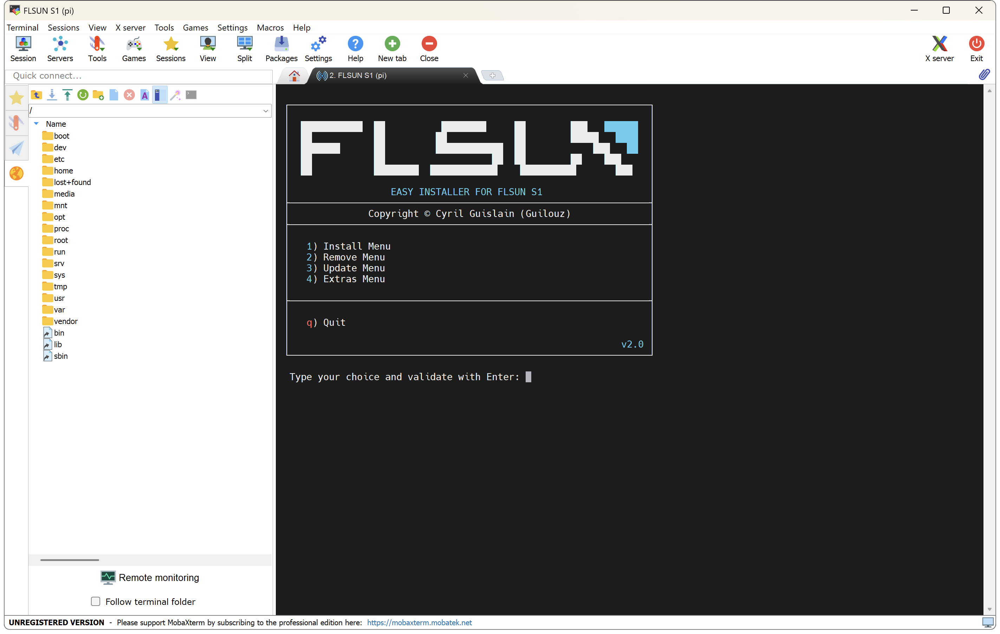
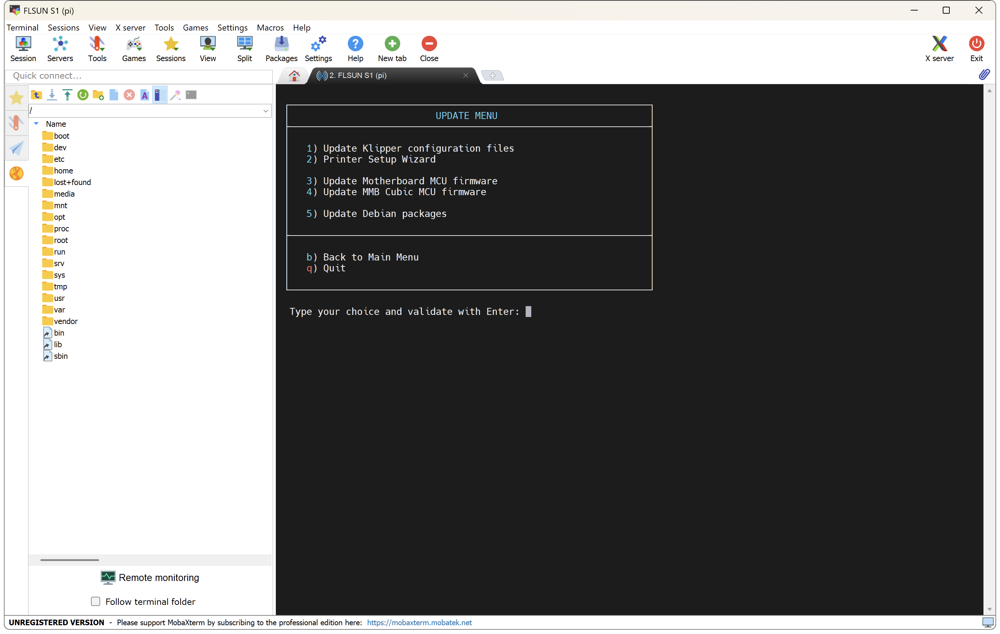

When you have already flashed the firmware (with the Katapult Bootloader), you will be able to update your motherboard MCU with a future **Klipper Firmware**.

!!! Note
    MCUs have limited write cycles (about 10K cycles for a STM32 chip). Updating the firmware with each Klipper release could shorten the life of your MCU!<br /><br />
    <i>**When is it necessary to update Klipper firmware?**</i><br />
    Every time Klipper mentions to update the MCU at startup, no more.


- Connect to printer over SSH (see <a href="../ssh-connection">:material-console: SSH Connection</a> section).

- In the SSH command prompt window, enter the following command to start **Easy Installer**:

    ``` title="SSH Command Prompt"
    easy-installer
    ```

    

- Enter ++"3"++ for **Extras** menu → ++"2"++ for **Update Motherboard MCU firmware** → ++"Enter"++ to confirm your choice:

    

- Klipper Firmware will be builded and flashed.


### Extras
<hr>

You can build your own **Katapult Bootloader** and **Klipper Firmware** and combine them into a ready-to-flash file. 

- Connect to printer over SSH (see <a href="../ssh-connection">:material-console: SSH Connection</a> section).

- In the SSH command prompt window, enter the following commands (one at a time) to configure **Katapult Bootloader**:

    ``` title="SSH Command Prompt"
    cd ~/katapult && git reset --hard && git pull
    ```
    ``` title="SSH Command Prompt"
    make menuconfig
    ```

- Move on the menu with the ++"↑"++ and ++"↓"++ keys of your keyboard and validate the selected item with the ++"Enter"++ key and select these settings:

    


- Then on your keyboard press the ++"Q"++ key then ++"Y"++ to save configuration.

- Enter the following command to compile **Katapult Bootloader**:

    ``` title="SSH Command Prompt"
    make clean && make
    ```

- When it's done, enter the following commands (one at a time) to configure **Klipper Firmware**:

    ``` title="SSH Command Prompt"
    cd ~/klipper && git reset --hard && git pull
    ```
    ``` title="SSH Command Prompt"
    make menuconfig
    ```

- Move on the menu with the ++"↑"++ and ++"↓"++ keys of your keyboard and validate the selected item with the ++"Enter"++ key and select these settings:

    


- Then on your keyboard press the ++"Q"++ key then ++"Y"++ to save configuration.

- Enter the following command to compile **Klipper Firmware**:

    ``` title="SSH Command Prompt"
    make clean && make
    ```

- When it's done, enter the following command to combine **Katapult Bootloader** and **Klipper Firmware** into a ready-to-flash file:

    ``` title="SSH Command Prompt"
    cd && ./flsun-os/system/merge_firmware.py
    ```

- Get the firmware named **`motherboard_fw.bin`** in **`/home/pi`** directory (on the left panel of **MobaXterm**, right click on the file and select `Download`).

<br />

**If you like my work, don't hesitate to support me by paying me a 🍺 or a ☕. Thank you 🙂**

<a href="https://ko-fi.com/guilouz" target="_blank"></a>
