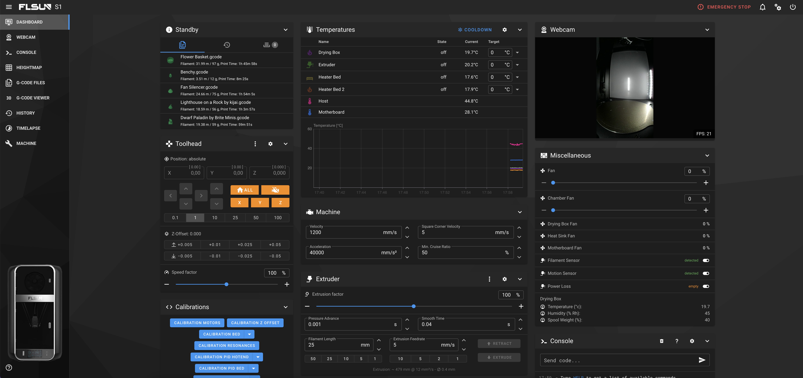
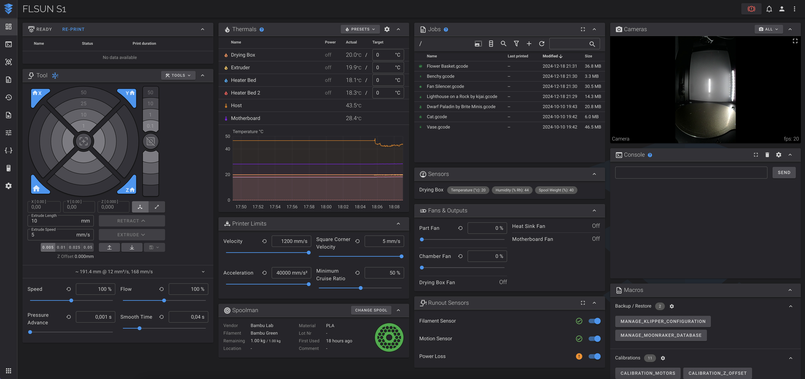
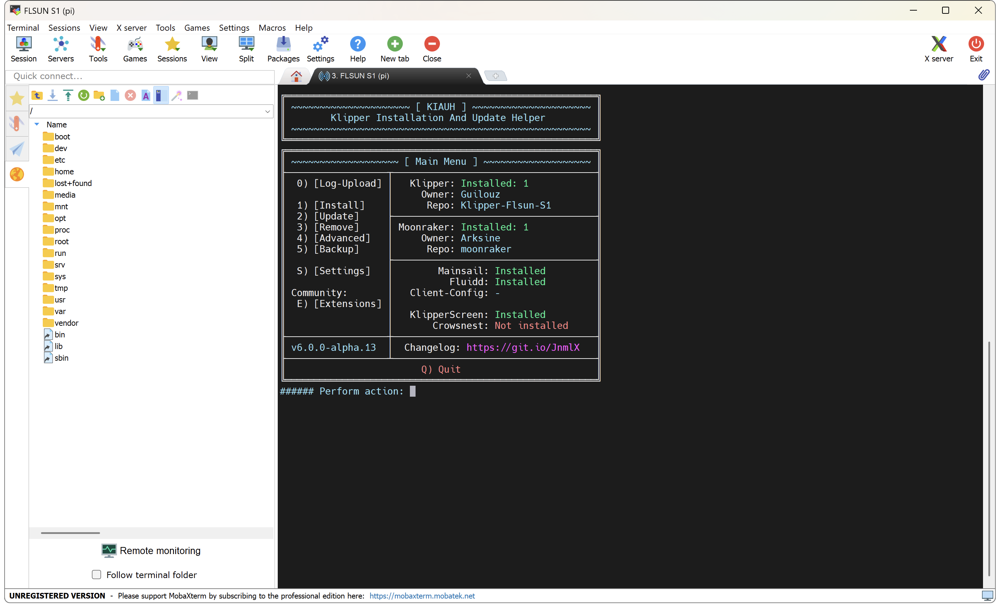
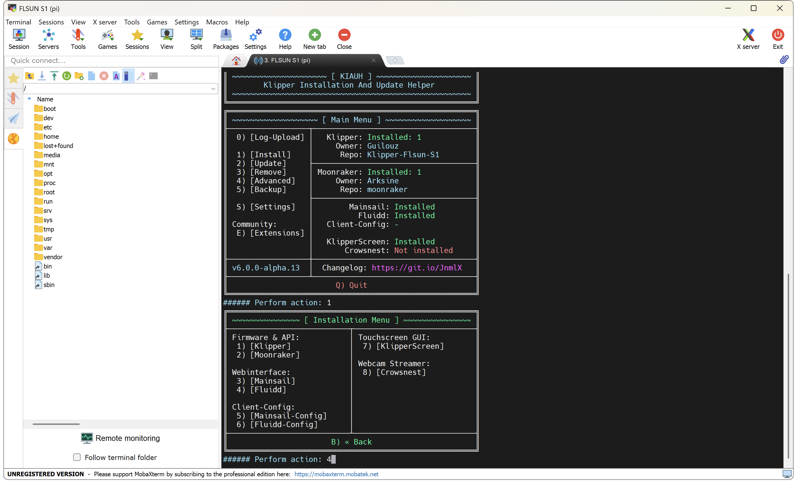
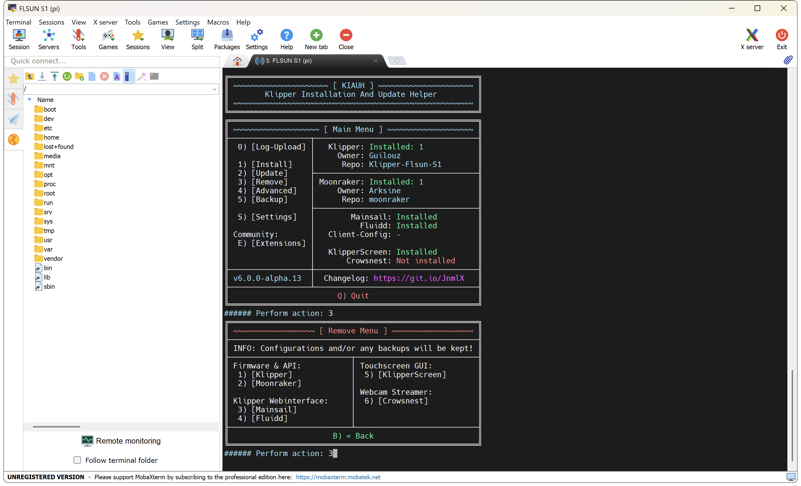

By default only **Mainsail** is installed but you can also install **Fluidd**.

**You have two possibilities:**

  - Keep Mainsail on port 80 and install Fluidd on port 81
  - Remove Mainsail and install Fluidd on port 80

| Mainsail |
| :---------: |
|  |

| Fluidd |
| :---------: |
|  |


- Connect to printer over SSH (see <a href="../ssh-connection">:material-console: SSH Connection</a> section).

- In the SSH command prompt window, start **Kiauh** by entering this command: 

    ```
    kiauh
    ```

    

 
### Keep Mainsail and install Fluidd on port 81
<hr>

- Enter ++"1"++ for **Install** menu → ++"4"++ for **Fluidd** → Enter ++"81"++ for **port number** → Enter ++"N"++ to **not** install the recommended macros:

    


    You can access to **Mainsail** with `http://xxx.xxx.xx.xxx/` (replacing **xxx.xxx.xxx.xxx** by your local IP address).<br>
    You can access to **Fluidd** with `http://xxx.xxx.xxx.xxx:81/` (replacing **xxx.xxx.xxx.xxx** by your local IP address).


### Remove Mainsail and install Fluidd on port 80
<hr>

- Enter ++"3"++ for **Remove** menu → ++"3"++ for **Mainsail**:

	

- Enter ++"B"++ to go back → ++"1"++ for **Install** menu → ++"4"++ for **Fluidd** → Enter ++"N"++ to **not** install the recommended macros:

	


    You can access to **Fluidd** with `http://xxx.xxx.xxx.xxx/` (replacing **xxx.xxx.xxx.xxx** by your local IP address).

<br />

**If you like my work, don't hesitate to support me by paying me a 🍺 or a ☕. Thank you 🙂**

<a href="https://ko-fi.com/guilouz" target="_blank"></a>
