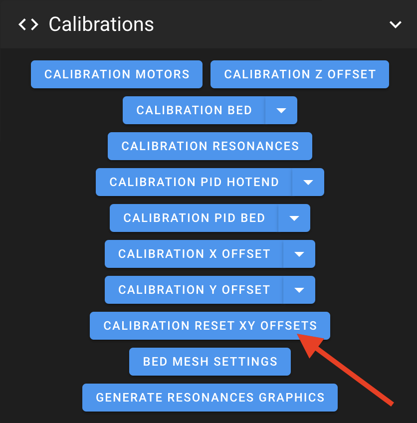
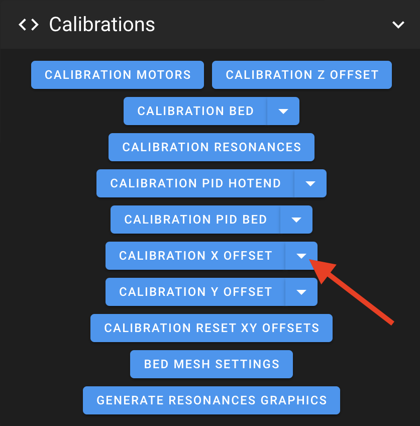
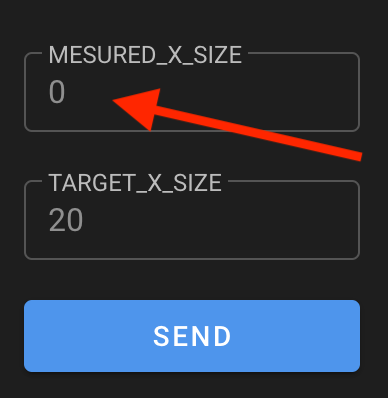
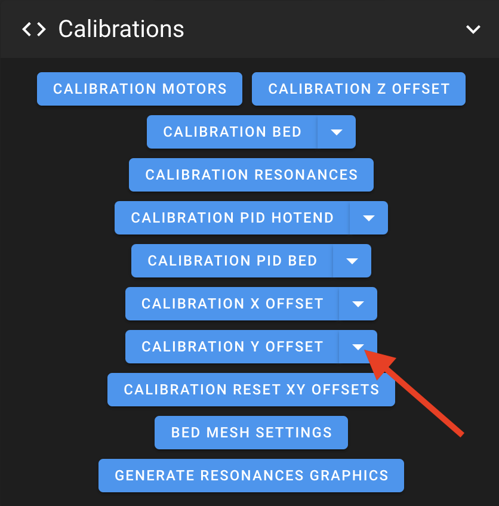
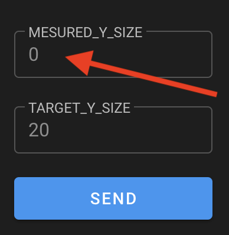

This can be useful if the accuracy of your dimensions is not acceptable.

- Download this calibration cube: <a href="../assets/downloads/Calibration_Cube.stl">:material-download: Calibration_Cube.stl</a>

- Slice it and print it.

- Once printed, measure the X and Y dimensions. The ideal values ​​of this model are: X=20mm / Y=20mm.

- If you notice a significant deviation in the measured dimensions, it will therefore be necessary to apply a correction:

	- Open your Web Interface:

    - Run **`CALIBRATION_RESET_XY_OFFSETS`** macro to reset existing values:

		

	- Wait for **Klipper** to restart.

	- If you notice a deviation in X,  click on the down arrow at the **`CALIBRATION_X_OFFSET`** macro:

		

	- Enter the value you measured in **X** (in millimeters) and click the **`SEND`**  button:

		

	- Wait for **Klipper** to restart.
	
	- Correction is now applied for **X** axis in your **`printer.cfg`** file.

	- If you notice a deviation in Y,  click on the down arrow at the **`CALIBRATION_Y_OFFSET`** macro:

		

	- Enter the value you measured in **Y** (in millimeters) and click the **`SEND`**  button:

		

	- Wait for **Klipper** to restart.
	
	- Correction is now applied for **Y** axis in your **`printer.cfg`** file.

	- You can reprint your model to see if the accuracy of your dimensions is now acceptable.

 

**If you like my work, don't hesitate to support me by paying me a 🍺 or a ☕. Thank you 🙂**

